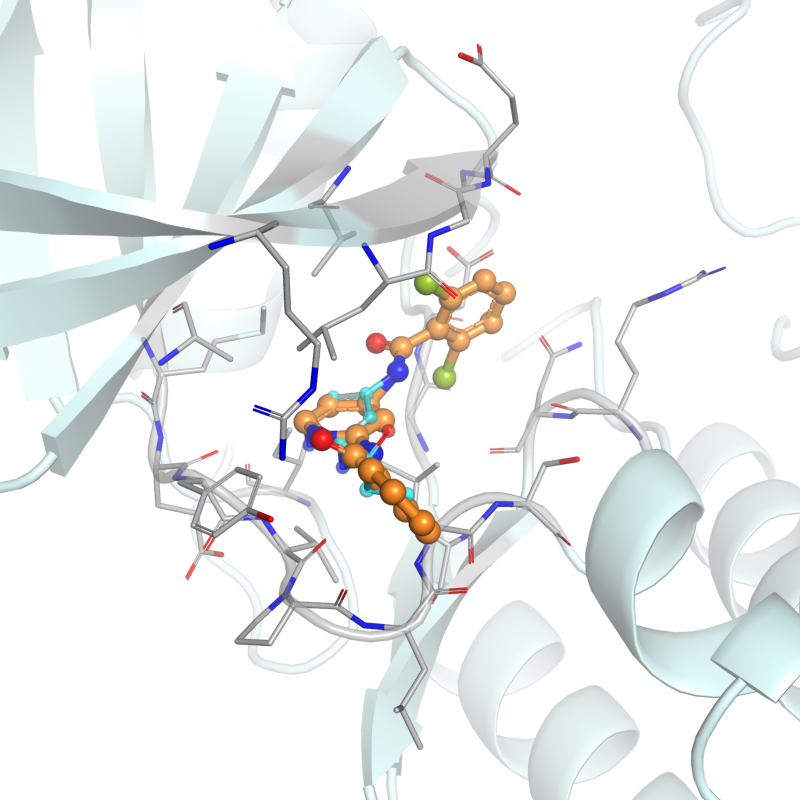
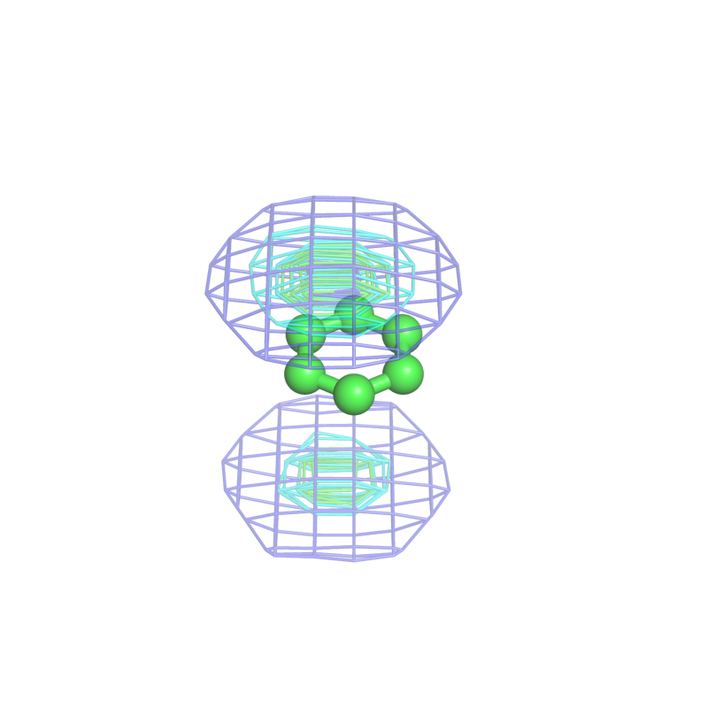
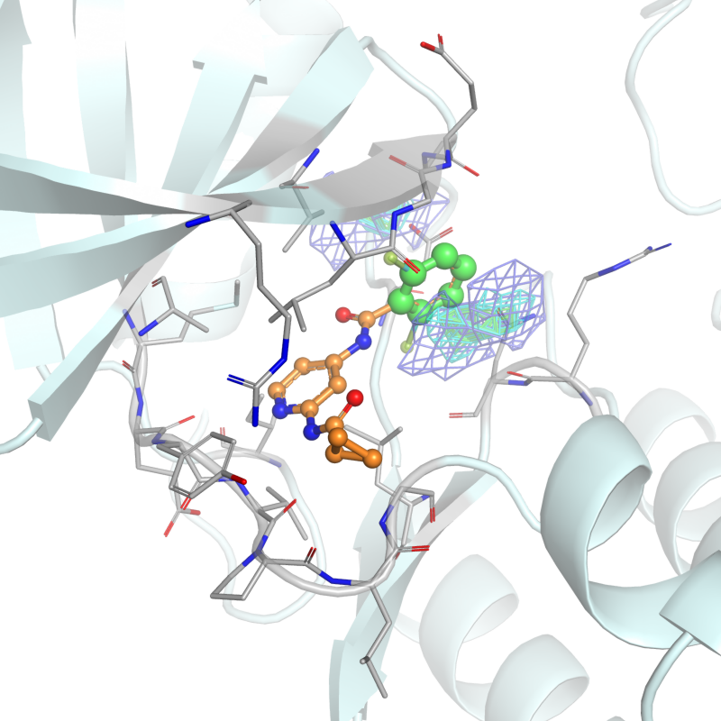

# inverse_msmd

混合溶媒分子動力学法（MSMD）の逆解析ツール

## 概要

**リガンド中のプローブ部分構造を入れ替えて、その置換がどれだけ良いかスコアリングするツール**です。

タンパク質-リガンド複合体に対して、リガンド中のプローブ部分構造を入れ替え、MSMDプロファイルマップと重ね合わせてスコアリングします。

| (A) 複合体構造 | (B) プローブ＋プロファイルマップ | (C) 統合結果 |
|:---:|:---:|:---:|
|  |  |  |
| タンパク質＋リガンド | プローブ（緑）＋相互作用マップ | (A)を(B)の座標系に変換して統合 |

## 特徴

- **統合部分構造置換**: MCSベースの原子マッチング + 構造重ね合わせ + 立体障害チェック
- **バッチ処理**: 複数の置換パターンを並列処理し、スコアリング・3D描画まで自動実行
- **3D構造描画**: PyMOLによるタンパク質-リガンド複合体、プローブマップの自動描画

## インストール

```bash
git clone https://github.com/keisuke-yanagisawa/inverse_msmd.git
cd inverse_msmd
pip install -e .[dev]
```

rdkitは`conda`経由を推奨: `conda install -c conda-forge rdkit`

## クイックスタート

```bash
# 1件だけ試す（部分構造置換 + スコア計算）
python scripts/integrated_replacement.py \
    --ligand data/atom_matching/4hw3_A_lig.sdf \
    --protein data/sample_proteins/4hw3_A.pdb \
    --from-file data/sample_probes/E23 \
    --to-file data/sample_probes/E24 \
    --output output/integrated/ \
    --profile-dir data/profiles --probe-id E24

# バッチ処理（並列 + 3D描画）
python scripts/run_batch.py \
    --batch-csv examples/batch_config_sample.csv \
    --ligand data/atom_matching/4hw3_A_lig.sdf \
    --protein data/sample_proteins/4hw3_A.pdb \
    --probe-dir data/sample_probes \
    --profile-dir data/profiles \
    --output output/batch_results \
    --parallel --render-figures
```

**入力**: タンパク質PDB + リガンドSDF + プローブ分子ペア（置換前/後）
**出力**: 置換後リガンドSDF + 変換済みタンパク質PDB + スコア + 3Dパネル画像

## ドキュメント

- [チュートリアル](docs/tutorial.md) — 単一ジョブ・バッチ処理の詳細な使い方
- [テスト](docs/testing.md) — テストの実行方法

## 引用

このパッケージを使用する場合は、適切な引用を行ってください。

## ライセンス

MIT License — [LICENSE](LICENSE)

## 著者

Keisuke Yanagisawa (yanagisawa@comp.isct.ac.jp)
