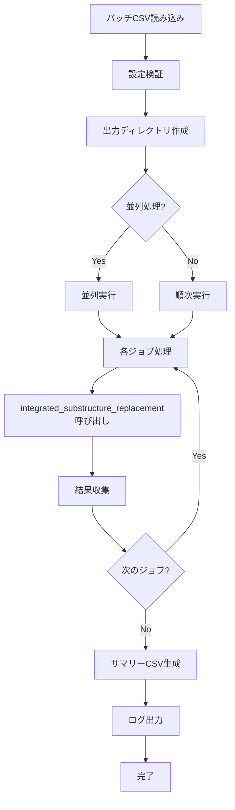

# Matching Scoreバッチ処理機能

## 概要

このドキュメントは、複数の置換パターン（置換前プローブ、置換後プローブ、置換位置）に対してmatching scoreを一括計算するバッチ処理機能の設計と実装方法を説明します。

## 背景と目的

### 背景

現在の[`integrated_substructure_replacement`](../../inverse_msmd/substructure_replacement.py)関数は、1つのリガンド-タンパク質ペアに対して、1組の置換パターン（from_probe、to_probe、match_index）を処理します。しかし、実際の研究では以下のような複数パターンを試行する必要があります：

- 複数の置換前プローブ（E23、A08など）
- 複数の置換後プローブ（E24、A08など）
- 複数の置換位置（match_index: 0, 1, 2など）

これらの組み合わせを手動で実行するのは非効率的で、エラーも発生しやすい問題があります。

### 目的

1. **効率化**: 複数パターンを自動的に処理
2. **再現性**: CSVファイルで実験条件を管理
3. **トレーサビリティ**: 全パターンの結果を構造化されたデータとして保存
4. **比較分析**: 複数パターンのスコアを一覧表示して最適なパターンを特定

## ユースケース

### 典型的な使用シナリオ

```
タンパク質: 4hw3_A.pdb
リガンド: 4hw3_A_lig.sdf

試したい置換パターン:
1. E23 → E24 (match_index=0)
2. E23 → E24 (match_index=1)
3. E23 → A08 (match_index=0)
4. A08 → E24 (match_index=0)
5. A08 → A08 (match_index=0, 1, 2)
```

これらをCSVファイルで定義し、一括で処理・スコア計算を実行します。

## 機能仕様

### 入力

#### 1. バッチ設定CSV

各行が1つの置換パターンを表すCSVファイル：

```csv
job_id,from_probe,to_probe,match_index,comment
job_001,E23,E24,0,基本パターン
job_002,E23,E24,1,別の置換位置
job_003,E23,A08,0,プローブ変更
job_004,A08,E24,0,逆パターン
```

**列の説明:**
- `job_id`: ジョブの一意識別子（出力ディレクトリ名に使用）
- `from_probe`: 置換前プローブID（例: E23）
- `to_probe`: 置換後プローブID（例: E24）
- `match_index`: 置換位置インデックス（0始まり）
- `comment`: 説明（オプション、ログ出力に使用）

#### 2. 共通パラメータ

全ジョブで共通のパラメータ：

- `ligand_file`: リガンドSDFファイルパス
- `protein_file`: タンパク質PDBファイルパス
- `probe_base_dir`: プローブファイルのベースディレクトリ
- `profile_base_dir`: プロファイルファイルのベースディレクトリ
- `output_base_dir`: 出力ベースディレクトリ

### 出力

#### 1. ディレクトリ構造

```
output_base_dir/
├── batch_summary.csv          # 全ジョブの結果サマリー
├── batch_summary.json         # JSON形式の結果（オプション）
├── batch_execution.log        # 実行ログ
├── job_001/                   # 各ジョブの出力
│   ├── pattern_0_ligand_replaced.sdf
│   ├── pattern_0_protein_aligned.pdb
│   ├── pattern_1_ligand_replaced.sdf
│   ├── pattern_1_protein_aligned.pdb
│   └── results.csv           # このジョブの詳細結果
├── job_002/
│   └── ...
└── job_003/
    └── ...
```

#### 2. バッチサマリーCSV

全ジョブの結果を1つのCSVにまとめたもの：

```csv
job_id,from_probe,to_probe,match_index,status,num_patterns,best_score,best_pattern_index,execution_time,error_message
job_001,E23,E24,0,success,3,-125.45,0,12.34,
job_002,E23,E24,1,success,2,-138.92,1,10.21,
job_003,E23,A08,0,failed,0,,,8.56,部分構造が見つかりませんでした
```

**列の説明:**
- `status`: 実行ステータス（success/failed/skipped）
- `num_patterns`: 生成されたパターン数
- `best_score`: 最高スコア（スコア計算時のみ）
- `best_pattern_index`: 最高スコアのパターン番号
- `execution_time`: 実行時間（秒）
- `error_message`: エラーメッセージ（失敗時のみ）

## アーキテクチャ設計

### モジュール構成

```
inverse_msmd/
├── batch_processing.py         # バッチ処理モジュール（新規）
├── substructure_replacement.py # 既存の統合ワークフロー
└── profile_scoring.py          # プロファイルスコア計算
```

### 主要関数

#### 1. `run_batch_processing()`

バッチ処理のメインエントリポイント。

```python
def run_batch_processing(
    batch_csv: str,
    ligand_file: str,
    protein_file: str,
    probe_base_dir: str,
    profile_base_dir: str,
    output_base_dir: str,
    parallel: bool = False,
    max_workers: int = 4,
    continue_on_error: bool = True
) -> Dict[str, Any]:
    """
    バッチ処理を実行します。
    
    Parameters
    ----------
    batch_csv : str
        バッチ設定CSVファイルのパス
    ligand_file : str
        リガンドSDFファイルのパス（全ジョブ共通）
    protein_file : str
        タンパク質PDBファイルのパス（全ジョブ共通）
    probe_base_dir : str
        プローブファイルのベースディレクトリ
        各プローブは {probe_base_dir}/{probe_id}.pdb, .smi として配置
    profile_base_dir : str
        プロファイルファイルのベースディレクトリ
    output_base_dir : str
        出力ベースディレクトリ
    parallel : bool, default=False
        並列処理を有効にするか
    max_workers : int, default=4
        並列処理時の最大ワーカー数
    continue_on_error : bool, default=True
        エラー発生時も処理を継続するか
    
    Returns
    -------
    Dict[str, Any]
        バッチ処理結果のサマリー
    """
```

#### 2. `load_batch_config()`

バッチ設定CSVを読み込む。

```python
def load_batch_config(batch_csv: str) -> List[Dict[str, Any]]:
    """
    バッチ設定CSVを読み込みます。
    
    Parameters
    ----------
    batch_csv : str
        バッチ設定CSVファイルのパス
    
    Returns
    -------
    List[Dict[str, Any]]
        各ジョブの設定辞書のリスト
    """
```

#### 3. `process_single_job()`

1つのジョブを処理する。

```python
def process_single_job(
    job_config: Dict[str, Any],
    ligand_file: str,
    protein_file: str,
    probe_base_dir: str,
    profile_base_dir: str,
    output_base_dir: str
) -> Dict[str, Any]:
    """
    単一ジョブを処理します。
    
    Parameters
    ----------
    job_config : Dict[str, Any]
        ジョブ設定辞書
    ligand_file : str
        リガンドファイルパス
    protein_file : str
        タンパク質ファイルパス
    probe_base_dir : str
        プローブベースディレクトリ
    profile_base_dir : str
        プロファイルベースディレクトリ
    output_base_dir : str
        出力ベースディレクトリ
    
    Returns
    -------
    Dict[str, Any]
        ジョブ実行結果
    """
```

### 処理フロー



### エラーハンドリング

#### 1. エラーレベル

- **Critical**: バッチ処理全体を停止すべきエラー
  - バッチCSVが読めない
  - 出力ディレクトリが作成できない
  
- **Job-level**: 個別ジョブの失敗（continue_on_error=Trueなら継続）
  - 部分構造が見つからない
  - プロファイルファイルが欠落
  - スコア計算エラー

#### 2. エラー処理戦略

```python
# continue_on_error=True の場合
try:
    result = process_single_job(...)
except Exception as e:
    # エラーを記録して次のジョブへ
    result = {
        'status': 'failed',
        'error_message': str(e)
    }
    logger.error(f"Job {job_id} failed: {e}")
    
# continue_on_error=False の場合
try:
    result = process_single_job(...)
except Exception as e:
    logger.error(f"Job {job_id} failed: {e}")
    raise  # バッチ処理を中断
```

### 進捗管理

#### 1. プログレスバー

`tqdm`ライブラリを使用して進捗を表示：

```python
from tqdm import tqdm

for job in tqdm(jobs, desc="Processing batch"):
    process_single_job(job)
```

#### 2. ログ出力

標準的なPythonロギングを使用：

```python
import logging

logging.basicConfig(
    level=logging.INFO,
    format='%(asctime)s - %(levelname)s - %(message)s',
    handlers=[
        logging.FileHandler('batch_execution.log'),
        logging.StreamHandler()
    ]
)
```

## 並列処理

### 実装方針

`concurrent.futures.ProcessPoolExecutor`を使用：

```python
from concurrent.futures import ProcessPoolExecutor, as_completed

def run_batch_parallel(jobs, max_workers=4):
    with ProcessPoolExecutor(max_workers=max_workers) as executor:
        futures = {
            executor.submit(process_single_job, job): job
            for job in jobs
        }
        
        for future in as_completed(futures):
            job = futures[future]
            try:
                result = future.result()
                results.append(result)
            except Exception as e:
                logger.error(f"Job {job['job_id']} failed: {e}")
```

### 注意事項

- RDKitの分子オブジェクトはpickle化できないため、各プロセスで再読み込みが必要
- メモリ使用量に注意（大量のジョブを並列実行する場合）

## CSVファイル仕様

### 必須列

- `job_id`: ジョブID（文字列、ユニークである必要がある）
- `from_probe`: 置換前プローブID
- `to_probe`: 置換後プローブID
- `match_index`: 置換位置インデックス（整数）

### オプション列

- `comment`: コメント（文字列）
- `enabled`: 有効/無効フラグ（yes/no または true/false）

### CSV例

```csv
job_id,from_probe,to_probe,match_index,comment,enabled
exp_001,E23,E24,0,基本パターン - 位置0,yes
exp_002,E23,E24,1,基本パターン - 位置1,yes
exp_003,E23,A08,0,プローブ変更テスト,yes
exp_004,A08,E24,0,逆方向パターン,no
exp_005,A08,A08,0,同一プローブ,yes
```

### バリデーション

- `job_id`: 空でない、重複なし
- `match_index`: 非負整数
- プローブファイルの存在確認（実行時）

## 使用例

### 基本的な使用

```python
from inverse_msmd.batch_processing import run_batch_processing

# バッチ処理を実行
results = run_batch_processing(
    batch_csv="experiments/batch_config.csv",
    ligand_file="data/atom_matching/4hw3_A_lig.sdf",
    protein_file="data/sample_proteins/4hw3_A.pdb",
    probe_base_dir="data/sample_probes",
    profile_base_dir="data/profiles",
    output_base_dir="output/batch_results"
)

print(f"完了: {results['num_success']} 成功, {results['num_failed']} 失敗")
```

### 並列処理

```python
# 4つの並列ワーカーで実行
results = run_batch_processing(
    batch_csv="experiments/batch_config.csv",
    ligand_file="data/atom_matching/4hw3_A_lig.sdf",
    protein_file="data/sample_proteins/4hw3_A.pdb",
    probe_base_dir="data/sample_probes",
    profile_base_dir="data/profiles",
    output_base_dir="output/batch_results",
    parallel=True,
    max_workers=4
)
```

### CLIスクリプト

```bash
# scripts/run_batch.py として実装
python scripts/run_batch.py \
    --batch-csv experiments/batch_config.csv \
    --ligand data/atom_matching/4hw3_A_lig.sdf \
    --protein data/sample_proteins/4hw3_A.pdb \
    --probe-dir data/sample_probes \
    --profile-dir data/profiles \
    --output output/batch_results \
    --parallel \
    --max-workers 4
```

## テスト計画

### ユニットテスト

1. `load_batch_config()`: CSV読み込みとバリデーション
2. `process_single_job()`: 単一ジョブ処理
3. エラーハンドリング

### 統合テスト

1. 小規模バッチ（3-5ジョブ）の実行
2. エラー混在バッチの処理
3. 並列処理の動作確認

### 性能テスト

1. 大規模バッチ（100+ ジョブ）の実行時間
2. 並列処理のスケーラビリティ
3. メモリ使用量の監視

## 実装優先順位

### Phase 1: 基本機能（必須） ✅ **完了**

- [x] バッチ設定CSV読み込み
- [x] 順次処理実装
- [x] サマリーCSV出力
- [x] エラーハンドリング
- [x] 基本的なログ出力
- [x] ユニットテスト（21テスト、全てパス）
- [x] サンプルスクリプト
- [x] JSON出力対応

**実装成果物:**
- `inverse_msmd/batch_processing.py` (743行)
- `examples/batch_config_sample.csv`
- `examples/batch_processing_example.py` (126行)
- `tests/unit/test_batch_processing.py` (420行、21テスト）

### Phase 2: 拡張機能（未実装）

- [ ] 並列処理対応
- [x] プログレスバー表示（tqdm使用）
- [ ] CLIスクリプト

### Phase 3: 最適化（未実装）

- [ ] メモリ使用量の最適化
- [x] 実行時間の計測とレポート
- [ ] リトライ機能
- [ ] チェックポイント機能（中断・再開）

## 参考リンク

- [既存の統合ワークフロー](../../inverse_msmd/substructure_replacement.py)
- [プロファイルスコア計算](../../inverse_msmd/profile_scoring.py)
- [サンプルスクリプト](../../examples/README.md)