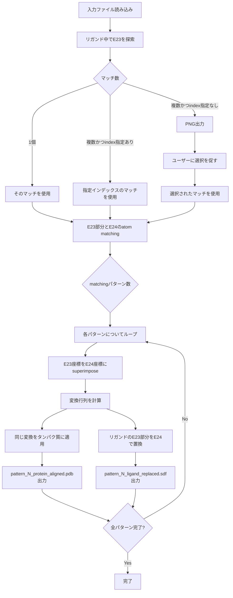

# 統合部分構造置換機能 実装計画

## 概要

`integrated_alignment`と`replace_substructure`を組み合わせた新機能を実装します。この機能により、リガンド中の部分構造を別の部分構造で置換しつつ、タンパク質構造も適切に座標変換します。

## 要求仕様

### 入力
- 置換前の部分構造（例: E23）
- 置換後の部分構造（例: E24）
- 置換を行いたいリガンド（例: 4hw3_A_lig.sdf）
- そのリガンドが結合しているタンパク質構造（例: 4hw3_A.pdb）

### 処理フロー

1. **部分構造探索**: リガンド中から置換前の部分構造（E23）を探索
   - 複数マッチがある場合：PNG画像を出力し、ユーザーに選択を促す
   - 1つのみの場合：自動的に選択
   - CLIオプションで事前に選択インデックスを指定可能

2. **Atom Matching**: 特定されたリガンド部分構造と置換後の部分構造（E24）との原子対応付け
   - 複数のマッチングパターンが生じても問題なし

3. **座標変換と置換**: 各マッチングパターンについて以下を実行
   - 3-1. Atom matchingに基づいて、置換後部分構造の座標にリガンドをsuperimpose
   - 3-2. 同じ変換行列をタンパク質構造に適用（相対位置関係を保持）
   - 3-3. Atom matchingに基づいてリガンド構造の置換を実行（結合切断に注意）

### 出力
各atom matchingパターンごとに：
- `pattern_N_ligand_replaced.sdf`: 置換後のリガンド構造
- `pattern_N_protein_aligned.pdb`: 座標変換後のタンパク質構造
- `substructure_matches.png`: 複数マッチ時の可視化画像

## アーキテクチャ設計

### ファイル構成

```
inverse_msmd/
├── alignment.py（既存）
├── substructure_replacement.py（新規）
└── utils/
    ├── bio_utils.py（既存）
    ├── mol_utils.py（既存）
    └── ...

scripts/
├── replace_substructure.py（既存）
└── integrated_replacement.py（新規）
```

### 主要モジュール

#### 1. `inverse_msmd/substructure_replacement.py`（新規）

統合機能のコアロジックを提供するモジュール

**主要関数:**

- `find_substructure_in_ligand(ligand_mol, substructure_mol) -> List[tuple]`
  - リガンド中の部分構造を探索
  - 複数マッチを全て返す
  
- `visualize_multiple_matches(ligand_mol, substructure_mol, matches, output_path)`
  - 複数マッチをPNG画像として可視化
  - マッチした部分をハイライト表示
  
- `match_substructures(ligand_submol, replacement_mol) -> List[np.ndarray]`
  - 2つの部分構造間のatom matchingを実行
  - 既存の`find_atom_matches()`を拡張/活用
  - 複数のマッチングパターンを返す
  
- `calculate_transformation(source_coords, target_coords, atom_pairs) -> (rot, tran)`
  - Superimposeによる変換行列（回転+並進）を計算
  - `SuperImposer`クラスを活用
  
- `apply_transformation_to_protein(protein, rot, tran) -> Structure`
  - 変換行列をタンパク質全体に適用
  - 相対位置関係を保持
  
- `replace_ligand_substructure(ligand_mol, match, replacement_mol, atom_pairs) -> Chem.Mol`
  - リガンドの部分構造を置換
  - 既存の`create_replacement()`を活用
  - 結合切断を防ぐ
  
- `integrated_substructure_replacement(ligand_file, protein_file, from_file, to_file, output_dir, match_index=None) -> List[dict]`
  - 統合ワークフロー関数
  - 全ての処理を統合
  - 結果を返す

#### 2. `scripts/integrated_replacement.py`（新規）

CLIインターフェース

**コマンドライン引数:**
```bash
python scripts/integrated_replacement.py \
    --ligand data/atom_matching/4hw3_A_lig.sdf \
    --protein data/sample_proteins/4hw3_A.pdb \
    --from-file data/sample_probes/E23 \
    --to-file data/sample_probes/E24 \
    --output output/integrated/ \
    [--match-index 0] \
    [--verbose]
```

**オプション:**
- `--ligand`: リガンドSDFファイル（必須）
- `--protein`: タンパク質PDBファイル（必須）
- `--from-file`: 置換前部分構造のベースパス（必須）
- `--to-file`: 置換後部分構造のベースパス（必須）
- `--output`: 出力ディレクトリ（必須）
- `--match-index`: 部分構造マッチのインデックス指定（オプション、0始まり）
- `--verbose`: 詳細出力（オプション）

## 処理フロー詳細



## データフロー

### 座標系の扱い

1. **RDKit座標系**（分子）
   - リガンド座標: `ligand_mol.GetConformer().GetPositions()`
   - 部分構造座標: `from_mol.GetConformer().GetPositions()`
   
2. **BioPython座標系**（タンパク質）
   - タンパク質座標: `PDB.get_attr(protein, "coord")`
   
3. **座標変換**
   - `SuperImposer`で計算した回転行列・並進ベクトルは両座標系で共通
   - NumPy配列として扱う

### 変換の適用順序

```python
# 1. リガンド部分構造の座標取得
ligand_submol_coords = ligand_coords[match_indices]

# 2. 置換後部分構造の座標取得
replacement_coords = replacement_mol.GetConformer().GetPositions()

# 3. Superimpose（変換行列計算）
si = SuperImposer()
si.fit(ligand_submol_coords[atom_pairs[0]], replacement_coords[atom_pairs[1]])
rot, tran = si.rot_, si.tran_

# 4. リガンド全体を変換
new_ligand_coords = si.transform(ligand_coords)

# 5. タンパク質も同じ変換
protein_coords = PDB.get_attr(protein, "coord")
new_protein_coords = si.transform(protein_coords)
PDB.set_attr(protein, "coord", new_protein_coords)

# 6. リガンド部分構造を置換
replaced_ligand = replace_ligand_substructure(...)
```

## 既存コードの再利用

### 1. Atom Matching
- **元コード**: [`inverse_msmd/alignment.py:find_atom_matches()`](inverse_msmd/alignment.py:102-188)
- **活用方法**: 
  - MCS検索のロジックを再利用
  - リガンド部分構造とE24のマッチングに適用
  - アイソトープラベル機能は不要なため簡略化可能

### 2. Superimpose
- **元コード**: [`inverse_msmd/utils/bio_utils.py:SuperImposer`](inverse_msmd/utils/bio_utils.py:39-168)
- **活用方法**:
  - `fit()`で変換行列を計算
  - `transform()`でリガンド・タンパク質両方に適用
  - 回転行列と並進ベクトルを直接取得（`rot_`, `tran_`）

### 3. 部分構造置換
- **元コード**: [`scripts/replace_substructure.py:create_replacement()`](scripts/replace_substructure.py:106-154)
- **活用方法**:
  - 部分構造置換のコアロジック
  - 結合情報の保持機能
  - プロパティのコピー機能

### 4. 可視化
- **元コード**: [`scripts/replace_substructure.py:draw_comparison()`](scripts/replace_substructure.py:404-456)
- **活用方法**:
  - 複数マッチの可視化に応用
  - `Draw.MolToImage()`を使用
  - ハイライト機能を追加

## 技術的考慮事項

### 1. 座標系の統一
- RDKit（分子）とBioPython（タンパク質）は異なるデータ構造
- NumPy配列での変換処理で統一
- 座標変換は両者で共通の数学的操作

### 2. 結合情報の保持
- 部分構造置換時に結合が切れないよう注意
- 既存の`create_replacement()`のロジックを活用
- 接続点の検出と新規結合の追加

### 3. 複数パターンの処理
- Atom matchingで複数パターンが生じる可能性
- 全パターンを出力（ユーザーが後で選択）
- ファイル名に`pattern_N`を含める

### 4. エラーハンドリング
- 部分構造が見つからない場合
- Atom matchingが失敗した場合
- ファイルI/Oエラー
- 適切なエラーメッセージと処理の中断

### 5. メモリ効率
- 大きなタンパク質構造でも扱えるよう配慮
- 不要なコピーを避ける
- 必要に応じてガベージコレクション

## 実装進捗

> **📊 詳細な実装進捗状況は [`implementation_progress.md`](implementation_progress.md) を参照してください。**
>
> このドキュメントには以下の詳細情報が含まれています：
> - 各タスクの実装内容と技術的詳細
> - テスト結果とコード例
> - 参考資料へのリンク
> - 次回作業の推奨事項
> - match_index機能テスト計画

### 実装タスクリスト（概要）

**Phase 1: 基本機能実装** ✅ 完了 (4/4)
- [x] T1: モジュール基本構造作成
- [x] T2: 部分構造探索関数実装
- [x] T3: 複数マッチ可視化関数実装
- [x] T4: Atom Matching関数実装

**Phase 2: 座標変換機能** ✅ 完了 (3/3)
- [x] T5: Superimpose計算関数実装
- [x] T6: タンパク質変換関数実装
- [x] T7: リガンド置換関数実装

**Phase 3: 統合とインターフェース** ⏳ 未着手 (0/3)
- [ ] T8-9: 統合ワークフロー関数実装
- [ ] T10: CLIスクリプト作成
- [ ] T11: 出力機能実装

**Phase 4: 品質保証** ⏳ 未着手 (0/3)
- [ ] T12: 総合テスト実行
- [ ] T13: エラーハンドリングとバリデーション追加
- [ ] T14: ドキュメントとusage example作成

**進捗率**: 50% (7/14タスク完了)

## 使用例

### 基本的な使用方法

```bash
# E23をE24に置換（自動選択）
python scripts/integrated_replacement.py \
    --ligand data/atom_matching/4hw3_A_lig.sdf \
    --protein data/sample_proteins/4hw3_A.pdb \
    --from-file data/sample_probes/E23 \
    --to-file data/sample_probes/E24 \
    --output output/integrated/
```

### マッチインデックスを指定

```bash
# 2番目のマッチを使用（0始まり）
python scripts/integrated_replacement.py \
    --ligand data/atom_matching/4hw3_A_lig.sdf \
    --protein data/sample_proteins/4hw3_A.pdb \
    --from-file data/sample_probes/E23 \
    --to-file data/sample_probes/E24 \
    --output output/integrated/ \
    --match-index 1
```

### Pythonスクリプトから呼び出し

```python
from inverse_msmd.substructure_replacement import integrated_substructure_replacement

results = integrated_substructure_replacement(
    ligand_file="data/atom_matching/4hw3_A_lig.sdf",
    protein_file="data/sample_proteins/4hw3_A.pdb",
    from_file="data/sample_probes/E23",
    to_file="data/sample_probes/E24",
    output_dir="output/integrated/",
    match_index=None  # または 0, 1, 2, ...
)

for i, result in enumerate(results):
    print(f"Pattern {i}:")
    print(f"  Ligand: {result['ligand_file']}")
    print(f"  Protein: {result['protein_file']}")
```

## 期待される出力

```
output/integrated/
├── substructure_matches.png      # 複数マッチ時のみ
├── pattern_0_ligand_replaced.sdf
├── pattern_0_protein_aligned.pdb
├── pattern_1_ligand_replaced.sdf
├── pattern_1_protein_aligned.pdb
└── ...
```

## テスト計画

1. **単一マッチケース**: E23が1箇所のみのリガンドで動作確認
2. **複数マッチケース**: E23が複数箇所あるリガンドで可視化と選択機能を確認
3. **エッジケース**:
   - 部分構造が見つからない場合
   - Atom matchingが失敗する場合
   - 不正なファイル入力
4. **座標変換の正確性**: 出力構造をPyMOL等で可視化して確認

## 参考リンク

- [`inverse_msmd/alignment.py`](inverse_msmd/alignment.py)
- [`scripts/replace_substructure.py`](scripts/replace_substructure.py)
- [`inverse_msmd/utils/bio_utils.py`](inverse_msmd/utils/bio_utils.py)
- [`inverse_msmd/utils/mol_utils.py`](inverse_msmd/utils/mol_utils.py)
- **[`implementation_progress.md`](implementation_progress.md)** - 詳細な実装進捗記録
