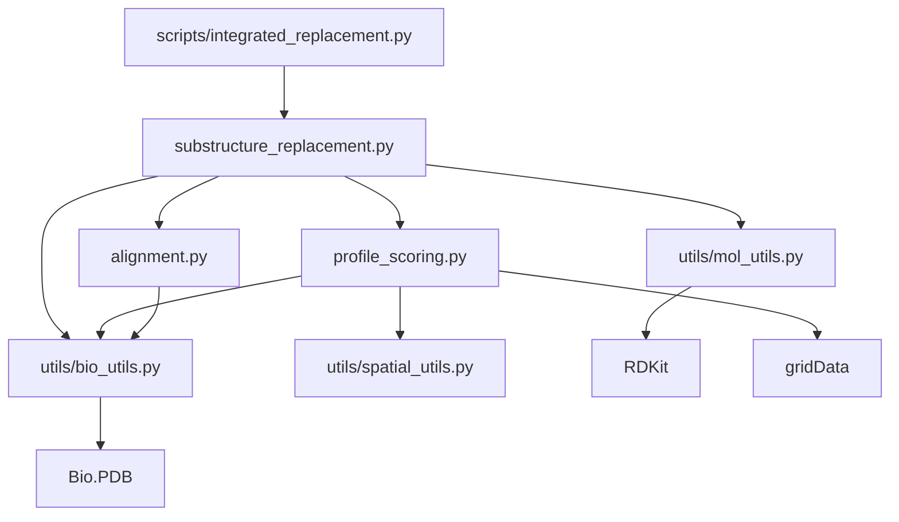
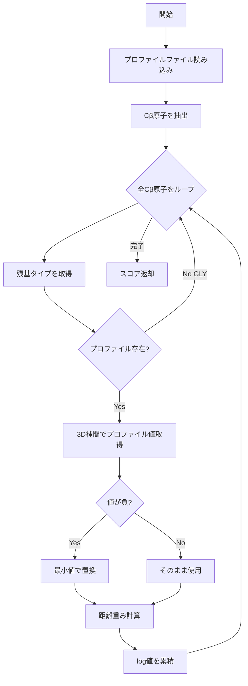
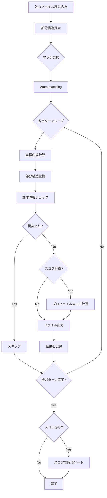
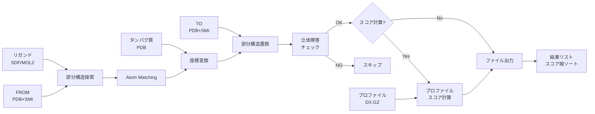
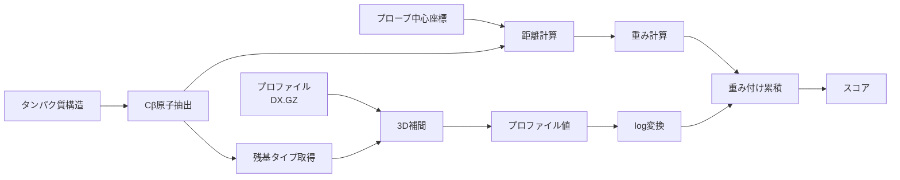

# プロファイルスコア計算機能 アーキテクチャ設計

## 概要

このドキュメントは、プロファイルマッチングスコア計算機能の統合におけるシステムアーキテクチャを説明します。

## システム全体構成

### モジュール構成

```
inverse_msmd/
├── __init__.py                    # パッケージエントリポイント（個別機能をエクスポート）
├── alignment.py                   # タンパク質構造アライメント機能
├── substructure_replacement.py    # 部分構造置換機能（スコア計算統合）
├── profile_scoring.py             # プロファイルスコア計算機能（新規）
└── utils/
    ├── bio_utils.py               # Bio.PDBラッパー
    ├── mol_utils.py               # RDKitユーティリティ
    ├── spatial_utils.py           # 空間計算
    └── path_utils.py              # パス処理
```

### モジュール間の依存関係



## 主要モジュール詳細

### 1. profile_scoring.py（新規）

**責務:** プロファイルマッチングスコアの計算

**主要関数:**

```python
def calculate_profile_score(
    protein: Structure,
    probe_center: np.ndarray,
    profile_dir: str,
    probe_id: str,
    gamma: float = 0.0
) -> float
```

**アルゴリズム:**



**技術的詳細:**

1. **プロファイル読み込み:**
   - 各残基タイプ（ALA, ARG, ...）のプロファイルを.dx.gz形式で読み込み
   - GLY残基はCβ原子を持たないためスキップ
   - gridDataライブラリを使用

2. **3D補間:**
   - 各Cβ原子の座標でプロファイル値を線形補間
   - グリッドポイント間の値を補間

3. **距離重み付け:**
   - `w(d) = exp(-gamma * d^2)`
   - gamma=0.0で重み付けなし（全て1.0）
   - gamma=0.003で距離に応じた減衰

4. **スコア計算:**
   - `score = Σ log(profile_value) * weight`
   - 対数スケールで統合

### 2. substructure_replacement.py（拡張）

**責務:** 統合ワークフロー（部分構造置換 + スコア計算）

**主要関数:**

```python
def integrated_substructure_replacement(
    ligand_file: str,
    protein_file: str,
    from_file: str,
    to_file: str,
    output_dir: str,
    match_index: Optional[int] = None,
    profile_dir: Optional[str] = None,      # 新規
    probe_id: Optional[str] = None,         # 新規
    gamma: float = 0.0                      # 新規
) -> List[Dict[str, Union[str, float, int]]]
```

**処理フロー:**



**個別機能のエクスポート:**

以下の関数がパッケージレベルでエクスポートされ、カスタムワークフローで利用可能：

- `find_substructure_in_ligand()`
- `visualize_multiple_matches()`
- `match_substructures()`
- `calculate_transformation()`
- `apply_transformation_to_protein()`
- `replace_ligand_substructure()`
- `check_steric_clash()`

### 3. __init__.py（更新）

**責務:** パッケージエントリポイント、個別機能のエクスポート

**エクスポート内容:**

```python
# 部分構造置換関連
from .substructure_replacement import (
    find_substructure_in_ligand,
    visualize_multiple_matches,
    match_substructures,
    calculate_transformation,
    apply_transformation_to_protein,
    replace_ligand_substructure,
    check_steric_clash,
    integrated_substructure_replacement
)

# プロファイルスコア関連
from .profile_scoring import calculate_profile_score

# ユーティリティ
from .utils.bio_utils import SuperImposer, PDB
from .utils.mol_utils import read_mol_from_pdb_smi
# ...
```

## データフロー

### 統合ワークフローのデータフロー



### プロファイルスコア計算のデータフロー



## 入出力仕様

### 入力ファイル形式

| ファイル | 形式 | 説明 | 例 |
|---------|------|------|-----|
| リガンド | SDF/MOL2 | 3D構造を持つリガンド | `4hw3_A_lig.sdf` |
| タンパク質 | PDB | タンパク質構造 | `4hw3_A.pdb` |
| FROM構造 | PDB+SMI | 置換元の部分構造 | `E23.pdb`, `E23.smi` |
| TO構造 | PDB+SMI | 置換先の部分構造 | `E24.pdb`, `E24.smi` |
| プロファイル | DX.GZ | 各残基のプロファイル | `E24_ALA_profile.dx.gz` |

### 出力ファイル形式

| ファイル | 形式 | 説明 | 例 |
|---------|------|------|-----|
| 置換後リガンド | SDF | 部分構造置換済みリガンド | `pattern_0_ligand_replaced.sdf` |
| 変換後タンパク質 | PDB | 座標変換済みタンパク質 | `pattern_0_protein_aligned.pdb` |

### 戻り値データ構造

```python
[
    {
        'ligand_file': 'output/pattern_0_ligand_replaced.sdf',
        'protein_file': 'output/pattern_0_protein_aligned.pdb',
        'pattern_index': 0,
        'score': -125.43  # オプション
    },
    # ... more patterns
]
```

## 設計原則

### 1. 後方互換性

- `profile_dir`が`None`の場合、スコア計算をスキップ
- 既存のワークフローは変更なしで動作

### 2. モジュラー設計

- 各機能は独立して利用可能
- カスタムワークフローの構築が容易

### 3. エラーハンドリング

```python
# プロファイルディレクトリの検証
if profile_dir is not None and probe_id is None:
    raise ValueError("profile_dirが指定されている場合、probe_idも必須です")

# プロファイルファイルの存在確認
if not profiles:
    raise ValueError(f"プロファイルファイルが見つかりません: {profile_dir}")

# Cβ原子の存在確認
if not cb_atoms:
    raise ValueError("Cβ原子が見つかりません")
```

### 4. パフォーマンス最適化

- プロファイルは各残基タイプにつき1回のみ読み込み
- Cβ原子の事前フィルタリング
- 必要な場合のみスコア計算を実行

## 技術スタック

| コンポーネント | ライブラリ/ツール | 用途 |
|--------------|-----------------|------|
| 化学構造処理 | RDKit | 部分構造探索、分子操作 |
| タンパク質処理 | Bio.PDB | PDBファイル読み書き、構造操作 |
| 3D補間 | gridData | プロファイル読み込みと補間 |
| 数値計算 | NumPy | 行列演算、座標変換 |
| 可視化 | Matplotlib | マッチング結果の可視化 |
| テスト | pytest | ユニットテスト、統合テスト |

## 拡張性

### 将来的な拡張案

1. **並列処理:**
   - 複数パターンの並列スコア計算
   - マルチプロセッシング対応

2. **キャッシング:**
   - プロファイルの再利用
   - 計算済みスコアのキャッシュ

3. **追加スコアリング:**
   - 他のスコアリング関数の統合
   - 複数スコアの重み付け統合

4. **バッチ処理:**
   - 複数リガンドの一括処理
   - レポート生成機能

## セキュリティとバリデーション

### 入力バリデーション

- ファイルパスの存在確認
- ファイル形式の検証
- パラメータの範囲チェック

### エラー時の動作

- 部分的な失敗時もファイル出力を継続
- 詳細なエラーメッセージの提供
- ログ出力による追跡可能性

## 参考リンク

- プロファイルスコア計算の理論: [元実装](../../examples/calculate_matching.py)
- RDKit Documentation: https://www.rdkit.org/docs/
- Bio.PDB Documentation: https://biopython.org/wiki/The_Biopython_Structural_Bioinformatics_FAQ
- gridData Documentation: https://www.mdanalysis.org/GridDataFormats/