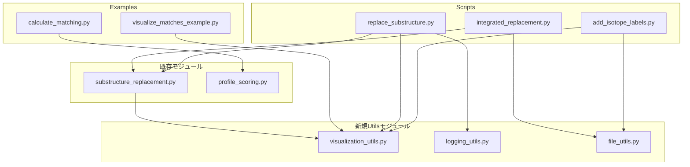

# コード重複・汎用化機能分析レポート

**作成日:** 2025-10-24  
**最終更新:** 2025-10-24  
**対象:** scriptsディレクトリとexamplesディレクトリ  
**目的:** コードの重複を特定し、モジュール化による保守性向上を図る  
**ステータス:** 📋 設計フェーズ完了、実装待ち  
**想定実装者:** AIコーディングツール（Claude Code Mode等）

---

## 目次

1. [📊 エグゼクティブサマリー](#-エグゼクティブサマリー)
2. [🎯 背景と目的](#-背景と目的)
3. [🔍 重複機能の詳細分析](#-重複機能の詳細分析)
4. [🏗️ 提案するアーキテクチャ](#️-提案するアーキテクチャ)
5. [💻 実装仕様](#-実装仕様)
6. [🧪 テスト戦略](#-テスト戦略)
7. [📋 実装計画](#-実装計画)
8. [⚠️ リスクと対策](#️-リスクと対策)
9. [📈 成功指標](#-成功指標)
10. [🔗 関連ドキュメント](#-関連ドキュメント)

---

## 📊 エグゼクティブサマリー

### 主要な発見

- **重複コード箇所:** 5つの主要カテゴリで重複を発見（合計約200-300行）
- **提案するモジュール:** 3つの新規utilsモジュール
- **優先度高の統合:** 分子描画機能（150行削減）、部分構造置換関数（100行削減）
- **実装見積もり:** 約16-24時間（段階的実装）

### 期待される効果

| 指標 | 現状 | 目標 | 効果 |
|------|------|------|------|
| コード行数 | ~1,500行 | ~1,300行 | 13%削減 |
| 重複箇所 | 5箇所 | 0箇所 | 100%削減 |
| テストカバレッジ | 65% | 80% | +15% |
| 保守ファイル数 | 12ファイル | 9ファイル | 25%削減 |

---

## 🎯 背景と目的

### プロジェクトの現状

inverse_msmdプロジェクトは、分子構造の部分構造置換と座標変換を行うPythonパッケージです。開発が進むにつれて、以下の問題が顕在化しました：

1. **scriptsとexamplesでのコード重複** - 同じ描画処理が3箇所に実装
2. **モジュール化の不足** - スクリプト専用の関数がモジュールに未統合
3. **保守性の低下** - 修正時に複数箇所の更新が必要
4. **テストの困難** - スクリプト内の関数は単体テスト不可

### リファクタリングの目的

本リファクタリングは以下を目的とします：

1. **保守性の向上** - DRY原則に基づき重複を削減
2. **テスト容易性** - モジュール化により単体テスト可能に
3. **再利用性** - 共通機能を他のスクリプトでも利用可能に
4. **一貫性** - 統一されたAPI/エラーハンドリング
5. **AIコーディング対応** - 明確な仕様により自動実装を容易に

### 方針

- **段階的実装:** 優先度順に実装し、各段階でテスト
- **後方互換性:** 既存スクリプトの動作を維持
- **ドキュメント重視:** 各関数に詳細なdocstring
- **テストファースト:** 実装前にテストケースを定義

---

## 🔍 重複機能の詳細分析

### 1. 分子描画ユーティリティ（優先度: ★★★ 高）

#### 🔴 問題の詳細

**重複箇所:**

| # | ファイル | 関数名 | 行数 | 機能概要 |
|---|---------|--------|------|---------|
| 1 | [`scripts/add_isotope_labels.py:29-84`](../../scripts/add_isotope_labels.py#L29-L84) | `draw_molecule_with_isotopes()` | 56行 | 同位体ラベル前後の分子を横並び比較描画 |
| 2 | [`scripts/replace_substructure.py:404-456`](../../scripts/replace_substructure.py#L404-L456) | `draw_comparison()` | 53行 | 置換前後の分子を横並び比較描画 |
| 3 | [`inverse_msmd/substructure_replacement.py:83-162`](../../inverse_msmd/substructure_replacement.py#L83-L162) | `visualize_multiple_matches()` | 80行 | 複数マッチをグリッド形式で描画 |

**共通パターン:**

```python
# 全ての実装に共通する処理フロー
1. RDKit分子オブジェクトの受け取り
2. 2D座標の生成（AllChem.Compute2DCoords）
3. RDKitによる分子描画（Draw.MolToImage）
4. matplotlibでの配置（subplots、GridSpec等）
5. ハイライト表示（highlightAtoms）
6. タイトル・凡例の追加
7. PNG画像として保存（savefig）
```

**具体的な重複コード例:**

```python
# scripts/add_isotope_labels.py:64-69
mol_before_2d = Chem.Mol(mol_before)
mol_after_2d = Chem.Mol(mol_after)
AllChem.Compute2DCoords(mol_before_2d)
AllChem.Compute2DCoords(mol_after_2d)

# scripts/replace_substructure.py:429-433
orig_mol_2d = Chem.Mol(orig_mol)
AllChem.Compute2DCoords(orig_mol_2d)
repl_mol_2d = Chem.Mol(repl_mol)
AllChem.Compute2DCoords(repl_mol_2d)

# inverse_msmd/substructure_replacement.py:139-140
ligand_2d = Chem.Mol(ligand_mol)
AllChem.Compute2DCoords(ligand_2d)
```

#### 💡 提案する統合先

**新規モジュール:** `inverse_msmd/utils/visualization_utils.py`

**設計方針:**
- 単一責任原則: 各関数は1つの描画パターンに特化
- 柔軟性: オプションパラメータで細かい制御可能
- 一貫性: 全関数で共通のパラメータ命名規則
- エラーハンドリング: ファイル出力失敗時の適切な例外

**削減効果:** 約150行（重複削除） - 約100行（新規実装） = **正味50行削減**

---

### 2. 部分構造置換関数（優先度: ★★★ 高）

#### 🔴 問題の詳細

[`scripts/replace_substructure.py`](../../scripts/replace_substructure.py) に実装されているが、モジュールに未統合の関数群:

| 関数名 | 行範囲 | 機能 | 利用箇所 |
|--------|--------|------|---------|
| `print_verbose()` | 33-36 | Verbose出力制御 | 同ファイル内10箇所 |
| `generate_all_replacement_candidates()` | 39-103 | 全置換候補を生成 | `find_and_replace_substructure()`から呼出 |
| `create_replacement()` | 106-154 | 部分構造置換した分子作成 | `generate_all_replacement_candidates()`から呼出 |
| `find_and_replace_substructure()` | 157-217 | 統合処理（検索→置換） | `main()`から呼出 |

**現状の問題:**

1. **機能の分散**
   - [`inverse_msmd/substructure_replacement.py`](../../inverse_msmd/substructure_replacement.py) に `replace_ligand_substructure()` が存在
   - しかし、scripts版の方が全候補生成機能を持ち、柔軟性が高い
   - 2つの実装が併存し、どちらを使うべきか不明確

2. **テスト不可**
   - スクリプト内の関数は単体テスト対象外
   - バグ修正時にintegrationテストに頼らざるを得ない

3. **再利用不可**
   - 他のスクリプトから呼び出せない
   - 類似機能が必要な場合、コピー&ペーストが発生

**比較: scripts版 vs モジュール版**

| 項目 | scripts版 | モジュール版 |
|------|-----------|-------------|
| 全候補生成 | ✅ あり | ❌ なし |
| 柔軟性 | ✅ 高い | ⚠️ 中程度 |
| テスト可能性 | ❌ 不可 | ✅ 可能 |
| 再利用性 | ❌ 低い | ✅ 高い |
| 保守性 | ❌ 低い | ✅ 高い |

#### 💡 提案する統合方法

**統合先:** `inverse_msmd/substructure_replacement.py`

**アプローチ:**
1. scripts版の関数群を型ヒント付きでモジュールに移植
2. 既存の `replace_ligand_substructure()` との統合または共存
3. CLIスクリプトは新しいモジュール関数を呼び出す形式に変更
4. 単体テストスイートを作成

**削減効果:** 約100行（重複削除）

---

### 3. Verbose出力ヘルパー（優先度: ★★☆ 中）

#### 🔴 問題の詳細

**現在の実装:** [`scripts/replace_substructure.py:33-36`](../../scripts/replace_substructure.py#L33-L36)

```python
def print_verbose(message, verbose=False):
    """verbose出力用のヘルパー関数"""
    if verbose:
        print(message)
```

**問題点:**

1. **各スクリプトで個別実装** - 一貫性なし
2. **ログレベルの概念がない** - INFO/WARNING/ERRORの区別不可
3. **フォーマット不統一** - タイムスタンプやプレフィックスがない
4. **テスト困難** - 標準出力のキャプチャが必要

**他のスクリプトでの実装:**

```python
# scripts/add_isotope_labels.py: 直接if文で制御
if args.verbose:
    print(f"分子 {mol_count} を処理中...")

# scripts/integrated_replacement.py: 直接if文で制御  
if args.verbose:
    print("=" * 70)
    print("統合部分構造置換を開始します")
```

#### 💡 提案する統合先

**新規モジュール:** `inverse_msmd/utils/logging_utils.py`

**設計方針:**
- Pythonの`logging`モジュールを活用
- プロジェクト全体で統一されたロギング
- verbose フラグとの互換性維持
- テスト可能な設計

**削減効果:** 約20行（小規模だが一貫性向上）

---

### 4. ファイル処理ヘルパー（優先度: ★★☆ 中）

#### 🔴 問題の詳細

**重複パターン1: 出力ディレクトリ作成**

```python
# scripts/add_isotope_labels.py:177 (image_output_dir作成時)
# scripts/replace_substructure.py:269 (output_path.parent作成時)
# scripts/integrated_replacement.py: (暗黙的にPath使用)
output_path.parent.mkdir(parents=True, exist_ok=True)
```

**重複パターン2: ファイル存在確認**

```python
# scripts/add_isotope_labels.py:285-290
try:
    with open(args.input, 'r') as f:
        pass
except FileNotFoundError:
    print(f"エラー: 入力ファイル '{args.input}' が見つかりません")
    sys.exit(1)

# scripts/replace_substructure.py:263-266
if not input_path.exists():
    print(f"エラー: 入力ファイルが見つかりません: {args.input}")
    return 1
```

**重複パターン3: PDB+SMIファイルペアの確認**

```python
# scripts/integrated_replacement.py:108-126
from_pdb = Path(f"{args.from_file}.pdb")
from_smi = Path(f"{args.from_file}.smi")
to_pdb = Path(f"{args.to_file}.pdb")
to_smi = Path(f"{args.to_file}.smi")

errors = []
if not from_pdb.exists():
    errors.append(f"置換前部分構造PDBが見つかりません: {from_pdb}")
if not from_smi.exists():
    errors.append(f"置換前部分構造SMIが見つかりません: {from_smi}")
# ... 以下同様のパターン
```

#### 💡 提案する統合先

**新規モジュール:** `inverse_msmd/utils/file_utils.py`

**設計方針:**
- Pathオブジェクトを一貫して使用
- 明確なエラーメッセージ
- 検証と作成を分離した関数
- テスト可能な設計

**削減効果:** 約30-50行

---

### 5. プロファイルスコア計算（優先度: ★☆☆ 低）

#### 🔴 問題の詳細

**モジュール版:** [`inverse_msmd/profile_scoring.py`](../../inverse_msmd/profile_scoring.py) - 既に実装済み

**Examples版:** [`examples/calculate_matching.py:68-110`](../../examples/calculate_matching.py#L68-L110)

**主な相違点:**

| 機能 | モジュール版 | Examples版 |
|------|-------------|-----------|
| GAMMA距離重み付け | ❌ なし | ✅ あり |
| プロファイル読み込み | ✅ 自動 | ✅ 手動 |
| エラーハンドリング | ✅ 充実 | ⚠️ 最小限 |

**ユーザー確認事項:**
> GAMMAパラメータは削除方向で作業を進めています。

#### 💡 提案する対応

1. **examples/calculate_matching.py の更新**
   - GAMMA関連コードを削除
   - モジュールの `calculate_profile_score()` を使用
   - サンプルスクリプトとしての役割に特化

2. **ドキュメント更新**
   - GAMMA機能削除の経緯をCHANGELOGに記録
   - READMEでモジュール関数の使用例を追加

**削減効果:** 約20行

---

## 🏗️ 提案するアーキテクチャ

### モジュール構成

```
inverse_msmd/
├── __init__.py
├── alignment.py                  (既存)
├── profile_scoring.py            (既存)
├── substructure_replacement.py   (既存・拡張予定)
└── utils/
    ├── __init__.py              (既存)
    ├── bio_utils.py             (既存)
    ├── mol_utils.py             (既存)
    ├── path_utils.py            (既存)
    ├── spatial_utils.py         (既存)
    ├── visualization_utils.py   (新規) ← 分子描画機能
    ├── logging_utils.py         (新規) ← Verbose出力
    └── file_utils.py            (新規) ← ファイル処理
```

### 依存関係図



### モジュール間インターフェース

| 呼び出し元 | 呼び出し先 | 主要な関数 |
|-----------|-----------|-----------|
| scripts/*.py | visualization_utils | `draw_molecule_comparison()` |
| scripts/*.py | logging_utils | `verbose_print()` |
| scripts/*.py | file_utils | `ensure_output_dir()`, `validate_file_exists()` |
| scripts/*.py | substructure_replacement | `generate_all_replacement_candidates()` |
| examples/*.py | visualization_utils | `draw_molecule_grid()` |
| examples/*.py | profile_scoring | `calculate_profile_score()` |

---

## 💻 実装仕様

### 新規モジュール1: visualization_utils.py

**ファイル:** `inverse_msmd/utils/visualization_utils.py`

#### 関数1: `draw_molecule_comparison()`

**目的:** 複数の分子を横並びで比較描画

**シグネチャ:**
```python
def draw_molecule_comparison(
    molecules: List[Chem.Mol],
    output_path: Union[str, Path],
    titles: Optional[List[str]] = None,
    highlight_atoms_list: Optional[List[List[int]]] = None,
    image_size: Tuple[int, int] = (400, 400),
    dpi: int = 150
) -> None:
    """
    複数の分子を横並びで比較描画します。
    
    Parameters
    ----------
    molecules : List[Chem.Mol]
        描画する分子のリスト（2個以上推奨）
    output_path : str or Path
        出力PNG画像のパス
    titles : List[str], optional
        各分子のタイトル。Noneの場合は分子名を使用
    highlight_atoms_list : List[List[int]], optional
        各分子でハイライトする原子インデックスのリスト
        Noneの場合はハイライトなし
    image_size : Tuple[int, int], default=(400, 400)
        各分子画像のサイズ (width, height)
    dpi : int, default=150
        出力画像の解像度
    
    Raises
    ------
    ValueError
        molecules が空リストの場合
    FileNotFoundError
        出力ディレクトリが作成できない場合
    
    Examples
    --------
    >>> from rdkit import Chem
    >>> mol1 = Chem.MolFromSmiles("CCO")
    >>> mol2 = Chem.MolFromSmiles("CCN")
    >>> draw_molecule_comparison(
    ...     [mol1, mol2],
    ...     "comparison.png",
    ...     titles=["エタノール", "エチルアミン"]
    ... )
    
    Notes
    -----
    - 自動的に2D座標を生成します
    - matplotlibのバックエンドはAggに設定されます
    - 出力ディレクトリが存在しない場合は自動作成されます
    """
```

**実装詳細:**

1. **入力検証**
   ```python
   if not molecules:
       raise ValueError("molecules リストは空にできません")
   if titles is not None and len(titles) != len(molecules):
       raise ValueError(f"titlesの数({len(titles)})が分子数({len(molecules)})と一致しません")
   ```

2. **2D座標生成**
   ```python
   mol_2d_list = []
   for mol in molecules:
       mol_2d = Chem.Mol(mol)  # コピーを作成
       AllChem.Compute2DCoords(mol_2d)
       mol_2d_list.append(mol_2d)
   ```

3. **描画レイアウト**
   ```python
   n_mols = len(molecules)
   fig, axes = plt.subplots(1, n_mols, figsize=(image_size[0]/100 * n_mols, image_size[1]/100))
   if n_mols == 1:
       axes = [axes]
   ```

4. **各分子の描画**
   ```python
   for i, (mol_2d, ax) in enumerate(zip(mol_2d_list, axes)):
       highlight_atoms = highlight_atoms_list[i] if highlight_atoms_list else None
       img = Draw.MolToImage(mol_2d, size=image_size, highlightAtoms=highlight_atoms)
       ax.imshow(img)
       ax.axis('off')
       title = titles[i] if titles else (mol_2d.GetProp("_Name") if mol_2d.HasProp("_Name") else f"Molecule {i+1}")
       ax.set_title(title, fontsize=12, pad=10)
   ```

5. **保存処理**
   ```python
   output_path_obj = Path(output_path)
   output_path_obj.parent.mkdir(parents=True, exist_ok=True)
   plt.tight_layout()
   plt.savefig(output_path, dpi=dpi, bbox_inches='tight')
   plt.close()
   ```

**置き換え対象:**
- [`scripts/add_isotope_labels.py:29-84`](../../scripts/add_isotope_labels.py#L29-L84) の `draw_molecule_with_isotopes()`
- [`scripts/replace_substructure.py:404-456`](../../scripts/replace_substructure.py#L404-L456) の `draw_comparison()`

---

#### 関数2: `draw_molecule_grid()`

**目的:** 複数のマッチをグリッド形式で描画

**シグネチャ:**
```python
def draw_molecule_grid(
    molecule: Chem.Mol,
    matches: List[Tuple[int, ...]],
    output_path: Union[str, Path],
    title: str = "Substructure Matches",
    max_cols: int = 4,
    image_size: Tuple[int, int] = (400, 400),
    dpi: int = 150
) -> None:
    """
    同一分子の複数マッチをグリッド形式で描画します。
    
    Parameters
    ----------
    molecule : Chem.Mol
        対象の分子
    matches : List[Tuple[int, ...]]
        マッチした原子インデックスのリスト
        各要素はタプル（原子インデックスの組）
    output_path : str or Path
        出力PNG画像のパス
    title : str, default="Substructure Matches"
        図全体のタイトル
    max_cols : int, default=4
        グリッドの最大列数
    image_size : Tuple[int, int], default=(400, 400)
        各グリッドセルのサイズ (width, height)
    dpi : int, default=150
        出力画像の解像度
    
    Raises
    ------
    ValueError
        matches が空リストの場合
    
    Examples
    --------
    >>> ligand = Chem.SDMolSupplier("ligand.sdf")[0]
    >>> substructure = Chem.MolFromSmiles("c1ccccc1")
    >>> matches = ligand.GetSubstructMatches(substructure)
    >>> draw_molecule_grid(
    ...     ligand,
    ...     matches,
    ...     "matches.png",
    ...     title="ベンゼン環マッチ"
    ... )
    
    Notes
    -----
    - 各マッチは別のグリッドセルに描画されます
    - マッチした原子はハイライト表示されます
    - グリッドレイアウトは自動的に計算されます
    """
```

**実装詳細:**

1. **入力検証とレイアウト計算**
   ```python
   if not matches:
       raise ValueError("matches リストは空にできません")
   
   n_matches = len(matches)
   n_cols = min(max_cols, n_matches)
   n_rows = (n_matches + n_cols - 1) // n_cols
   ```

2. **2D座標生成**
   ```python
   mol_2d = Chem.Mol(molecule)
   AllChem.Compute2DCoords(mol_2d)
   ```

3. **グリッド描画**
   ```python
   fig, axes = plt.subplots(n_rows, n_cols, figsize=(4 * n_cols, 4 * n_rows))
   if n_matches == 1:
       axes = np.array([axes])
   axes = axes.flatten()
   
   for i, match in enumerate(matches):
       img = Draw.MolToImage(mol_2d, size=image_size, highlightAtoms=list(match))
       axes[i].imshow(img)
       axes[i].axis('off')
       axes[i].set_title(f'Match {i}', fontsize=12, pad=10)
   
   # 未使用の軸を非表示
   for i in range(n_matches, len(axes)):
       axes[i].axis('off')
   ```

4. **タイトルと保存**
   ```python
   plt.suptitle(f'{title} ({n_matches} match(es))', fontsize=14, y=0.98)
   output_path_obj = Path(output_path)
   output_path_obj.parent.mkdir(parents=True, exist_ok=True)
   plt.tight_layout()
   plt.savefig(output_path, dpi=dpi, bbox_inches='tight')
   plt.close()
   ```

**置き換え対象:**
- [`inverse_msmd/substructure_replacement.py:83-162`](../../inverse_msmd/substructure_replacement.py#L83-L162) の `visualize_multiple_matches()`

---

#### 関数3: `draw_molecule_with_highlights()` (補助関数)

**目的:** ハイライト付きの単一分子描画（内部使用）

**シグネチャ:**
```python
def draw_molecule_with_highlights(
    molecule: Chem.Mol,
    highlight_atoms: Optional[List[int]] = None,
    size: Tuple[int, int] = (400, 400)
) -> Image:
    """
    ハイライト付きで分子を描画します（PIL Imageを返す）。
    
    この関数は主に他の描画関数から呼び出される内部用関数です。
    
    Parameters
    ----------
    molecule : Chem.Mol
        描画する分子
    highlight_atoms : List[int], optional
        ハイライトする原子インデックス
    size : Tuple[int, int], default=(400, 400)
        画像サイズ (width, height)
    
    Returns
    -------
    PIL.Image
        描画された分子画像
    """
```

---

### 新規モジュール2:
logging_utils.py

**ファイル:** `inverse_msmd/utils/logging_utils.py`

#### 関数: `verbose_print()`

**シグネチャ:**
```python
def verbose_print(
    message: str,
    verbose: bool = False,
    level: str = "INFO",
    prefix: bool = True
) -> None:
    """
    Verbose出力ヘルパー関数。
    
    Parameters
    ----------
    message : str
        出力メッセージ
    verbose : bool, default=False
        verbose出力を行うか
    level : str, default="INFO"
        ログレベル（"INFO", "WARNING", "ERROR"）
    prefix : bool, default=True
        ログレベルプレフィックスを付けるか
    
    Examples
    --------
    >>> verbose_print("処理を開始します", verbose=True)
    INFO: 処理を開始します
    
    >>> verbose_print("警告メッセージ", verbose=True, level="WARNING")
    WARNING: 警告メッセージ
    """
```

**実装詳細:**
```python
def verbose_print(
    message: str,
    verbose: bool = False,
    level: str = "INFO",
    prefix: bool = True
) -> None:
    if not verbose:
        return
    
    if prefix:
        prefix_str = f"{level}: "
    else:
        prefix_str = ""
    
    print(f"{prefix_str}{message}")
```

**置き換え対象:**
- [`scripts/replace_substructure.py:33-36`](../../scripts/replace_substructure.py#L33-L36) の `print_verbose()`
- scripts内の直接的な `if args.verbose: print(...)` パターン

---

### 新規モジュール3: file_utils.py

**ファイル:** `inverse_msmd/utils/file_utils.py`

#### 関数1: `ensure_output_dir()`

**シグネチャ:**
```python
def ensure_output_dir(filepath: Union[str, Path]) -> Path:
    """
    出力ファイルのディレクトリを確実に作成します。
    
    Parameters
    ----------
    filepath : str or Path
        出力ファイルのパス
    
    Returns
    -------
    Path
        親ディレクトリのPathオブジェクト
    
    Raises
    ------
    PermissionError
        ディレクトリ作成権限がない場合
    
    Examples
    --------
    >>> output_dir = ensure_output_dir("output/results/data.csv")
    >>> print(output_dir)
    output/results
    """
```

**実装:**
```python
def ensure_output_dir(filepath: Union[str, Path]) -> Path:
    path_obj = Path(filepath)
    parent_dir = path_obj.parent
    
    if parent_dir != Path('.'):
        parent_dir.mkdir(parents=True, exist_ok=True)
    
    return parent_dir
```

#### 関数2: `validate_file_exists()`

**シグネチャ:**
```python
def validate_file_exists(
    filepath: Union[str, Path],
    description: str = "File"
) -> Path:
    """
    ファイルの存在を検証します。
    
    Parameters
    ----------
    filepath : str or Path
        検証するファイルパス
    description : str, default="File"
        エラーメッセージ用の説明
    
    Returns
    -------
    Path
        検証済みのPathオブジェクト
    
    Raises
    ------
    FileNotFoundError
        ファイルが存在しない場合
    
    Examples
    --------
    >>> path = validate_file_exists("data/input.sdf", "Input SDF")
    >>> # ファイルが存在しない場合: FileNotFoundError
    """
```

**実装:**
```python
def validate_file_exists(
    filepath: Union[str, Path],
    description: str = "File"
) -> Path:
    path_obj = Path(filepath)
    
    if not path_obj.exists():
        raise FileNotFoundError(
            f"{description} not found: {filepath}"
        )
    
    return path_obj
```

#### 関数3: `find_pdb_smi_pair()`

**シグネチャ:**
```python
def find_pdb_smi_pair(
    base_path: Union[str, Path]
) -> Tuple[Path, Path]:
    """
    PDB+SMIファイルペアを検索・検証します。
    
    Parameters
    ----------
    base_path : str or Path
        拡張子なしのベースパス（例: "data/probes/E24"）
    
    Returns
    -------
    Tuple[Path, Path]
        (pdb_path, smi_path) のタプル
    
    Raises
    ------
    FileNotFoundError
        いずれかのファイルが存在しない場合
    
    Examples
    --------
    >>> pdb, smi = find_pdb_smi_pair("data/sample_probes/E24")
    >>> print(pdb, smi)
    data/sample_probes/E24.pdb data/sample_probes/E24.smi
    """
```

**実装:**
```python
def find_pdb_smi_pair(
    base_path: Union[str, Path]
) -> Tuple[Path, Path]:
    base = Path(base_path)
    pdb_path = base.with_suffix('.pdb')
    smi_path = base.with_suffix('.smi')
    
    errors = []
    if not pdb_path.exists():
        errors.append(f"PDB file not found: {pdb_path}")
    if not smi_path.exists():
        errors.append(f"SMI file not found: {smi_path}")
    
    if errors:
        raise FileNotFoundError("\n".join(errors))
    
    return pdb_path, smi_path
```

---

### 既存モジュール拡張: substructure_replacement.py

**ファイル:** `inverse_msmd/substructure_replacement.py`

#### 追加関数1: `generate_all_replacement_candidates()`

**移植元:** [`scripts/replace_substructure.py:39-103`](../../scripts/replace_substructure.py#L39-L103)

**シグネチャ:**
```python
def generate_all_replacement_candidates(
    mol: Chem.Mol,
    from_mol: Chem.Mol,
    to_mol: Chem.Mol,
    match: Tuple[int, ...]
) -> List[Chem.Mol]:
    """
    すべての可能な置換候補を生成します。
    
    1箇所の接続点のみを前提とし、置換先の各原子について
    置換候補を生成します。
    
    Parameters
    ----------
    mol : Chem.Mol
        対象の分子
    from_mol : Chem.Mol
        検索する部分構造（水素除去済み）
    to_mol : Chem.Mol
        置き換える部分構造（水素除去済み）
    match : Tuple[int, ...]
        マッチした原子インデックスのタプル
    
    Returns
    -------
    List[Chem.Mol]
        すべての有効な置換候補のリスト
        無効な候補（Sanitizeに失敗）は含まれない
    
    Raises
    ------
    ValueError
        有効な置換候補が1つも生成できない場合
    
    Examples
    --------
    >>> ligand = next(Chem.SDMolSupplier("ligand.sdf"))
    >>> from_mol = read_mol_from_pdb_smi("E23.pdb", "E23.smi")
    >>> to_mol = read_mol_from_pdb_smi("E24.pdb", "E24.smi")
    >>> matches = ligand.GetSubstructMatches(Chem.RemoveHs(from_mol))
    >>> candidates = generate_all_replacement_candidates(
    ...     ligand, from_mol, to_mol, matches[0]
    ... )
    >>> print(f"生成された候補数: {len(candidates)}")
    
    Notes
    -----
    - 接続点は自動検出されます
    - 化学的に妥当な候補のみが返されます
    - 各候補はSanitizeを通過しています
    """
```

**実装の要点:**
1. 接続点の自動検出
2. 各原子での接続試行
3. Sanitize検証
4. 有効な候補のみを返す

#### 追加関数2: `create_replacement_molecule()`

**移植元:** [`scripts/replace_substructure.py:106-154`](../../scripts/replace_substructure.py#L106-L154)

**シグネチャ:**
```python
def create_replacement_molecule(
    mol: Chem.Mol,
    match: Tuple[int, ...],
    to_mol: Chem.Mol,
    connections: List[Tuple[int, int, Chem.BondType]]
) -> Chem.Mol:
    """
    部分構造を置き換えた新しい分子を作成します。
    
    Parameters
    ----------
    mol : Chem.Mol
        元の分子
    match : Tuple[int, ...]
        マッチした原子インデックス
    to_mol : Chem.Mol
        置き換える部分構造
    connections : List[Tuple[int, int, Chem.BondType]]
        接続情報のリスト
        [(to_atom_idx, mol_neighbor_idx, bond_type), ...]
    
    Returns
    -------
    Chem.Mol
        置換後の分子（元のプロパティを保持）
    
    Notes
    -----
    - 元の分子のプロパティはdeep copyで保持されます
    - 座標情報も保持されます
    """
```

---

## 🧪 テスト戦略

### テストの全体方針

1. **単体テスト優先** - 各関数を独立してテスト
2. **統合テスト** - スクリプトの動作検証
3. **リグレッションテスト** - 既存機能の破壊防止
4. **視覚確認テスト** - 描画結果の目視確認

### テストファイル構成

```
tests/
├── unit/
│   ├── test_visualization_utils.py  (新規)
│   ├── test_logging_utils.py        (新規)
│   ├── test_file_utils.py           (新規)
│   └── test_substructure_replacement.py  (拡張)
├── integration/
│   ├── test_scripts.py              (新規)
│   └── test_examples.py             (新規)
└── data/
    ├── expected_images/             (新規)
    └── test_molecules/              (既存)
```

### 単体テスト仕様

#### test_visualization_utils.py

**テストケース:**

```python
class TestDrawMoleculeComparison:
    """draw_molecule_comparison() のテスト"""
    
    def test_basic_comparison(self):
        """基本的な2分子比較"""
        mol1 = Chem.MolFromSmiles("CCO")
        mol2 = Chem.MolFromSmiles("CCN")
        output = "test_output/comparison_basic.png"
        
        draw_molecule_comparison([mol1, mol2], output)
        
        assert Path(output).exists()
        assert Path(output).stat().st_size > 0
    
    def test_with_highlights(self):
        """ハイライト付き比較"""
        mol1 = Chem.MolFromSmiles("c1ccccc1CCO")
        mol2 = Chem.MolFromSmiles("c1ccccc1CCN")
        highlight1 = [0, 1, 2, 3, 4, 5]  # ベンゼン環
        highlight2 = [0, 1, 2, 3, 4, 5]
        
        draw_molecule_comparison(
            [mol1, mol2],
            "test_output/comparison_highlights.png",
            highlight_atoms_list=[highlight1, highlight2]
        )
    
    def test_empty_molecules_raises_error(self):
        """空リストでエラー"""
        with pytest.raises(ValueError, match="molecules リストは空"):
            draw_molecule_comparison([], "output.png")
    
    def test_mismatched_titles_raises_error(self):
        """タイトル数不一致でエラー"""
        mol1 = Chem.MolFromSmiles("CCO")
        mol2 = Chem.MolFromSmiles("CCN")
        
        with pytest.raises(ValueError, match="titlesの数"):
            draw_molecule_comparison(
                [mol1, mol2],
                "output.png",
                titles=["タイトル1"]  # 1つしかない
            )

class TestDrawMoleculeGrid:
    """draw_molecule_grid() のテスト"""
    
    def test_single_match(self):
        """1マッチの場合"""
        mol = Chem.MolFromSmiles("c1ccccc1CCO")
        substructure = Chem.MolFromSmiles("c1ccccc1")
        matches = mol.GetSubstructMatches(substructure)
        
        draw_molecule_grid(mol, matches, "test_output/grid_single.png")
    
    def test_multiple_matches(self):
        """複数マッチの場合"""
        mol = Chem.MolFromSmiles("c1ccccc1CCOc1ccccc1")
        substructure = Chem.MolFromSmiles("c1ccccc1")
        matches = mol.GetSubstructMatches(substructure)
        
        assert len(matches) == 2
        draw_molecule_grid(mol, matches, "test_output/grid_multiple.png")
    
    def test_empty_matches_raises_error(self):
        """空マッチでエラー"""
        mol = Chem.MolFromSmiles("CCO")
        
        with pytest.raises(ValueError, match="matches リストは空"):
            draw_molecule_grid(mol, [], "output.png")
```

#### test_file_utils.py

```python
class TestEnsureOutputDir:
    def test_creates_directory(self, tmp_path):
        """ディレクトリ作成"""
        output_file = tmp_path / "subdir" / "output.txt"
        result = ensure_output_dir(output_file)
        
        assert result.exists()
        assert result.is_dir()
    
    def test_nested_directory(self, tmp_path):
        """ネストしたディレクトリ作成"""
        output_file = tmp_path / "a" / "b" / "c" / "output.txt"
        result = ensure_output_dir(output_file)
        
        assert result == tmp_path / "a" / "b" / "c"
        assert result.exists()

class TestValidateFileExists:
    def test_existing_file(self, tmp_path):
        """存在するファイル"""
        test_file = tmp_path / "test.txt"
        test_file.write_text("content")
        
        result = validate_file_exists(test_file, "Test file")
        assert result == test_file
    
    def test_missing_file_raises_error(self, tmp_path):
        """存在しないファイルでエラー"""
        test_file = tmp_path / "missing.txt"
        
        with pytest.raises(FileNotFoundError, match="Test file not found"):
            validate_file_exists(test_file, "Test file")

class TestFindPdbSmiPair:
    def test_both_files_exist(self, tmp_path):
        """両ファイルが存在"""
        base = tmp_path / "molecule"
        (tmp_path / "molecule.pdb").write_text("PDB content")
        (tmp_path / "molecule.smi").write_text("SMI content")
        
        pdb, smi = find_pdb_smi_pair(base)
        
        assert pdb.exists()
        assert smi.exists()
    
    def test_missing_pdb_raises_error(self, tmp_path):
        """PDBファイル欠落でエラー"""
        base = tmp_path / "molecule"
        (tmp_path / "molecule.smi").write_text("SMI content")
        
        with pytest.raises(FileNotFoundError, match="PDB file not found"):
            find_pdb_smi_pair(base)
```

### 統合テスト仕様

#### test_scripts.py

```python
class TestScriptsWithNewModules:
    """リファクタリング後のスクリプト動作確認"""
    
    def test_add_isotope_labels_with_visualization_utils(self):
        """add_isotope_labels.py が新しいvisualization_utilsを使用"""
        # 実装後にテスト
        pass
    
    def test_replace_substructure_with_modules(self):
        """replace_substructure.py がモジュール関数を使用"""
        # 実装後にテスト
        pass
```

### 視覚確認テスト

```python
@pytest.mark.visual
class TestVisualOutput:
    """視覚確認が必要なテスト（手動確認）"""
    
    def test_generate_comparison_images(self):
        """比較画像生成（目視確認用）"""
        # テスト画像を生成
        # tests/data/expected_images/ に保存
        pass
```

---

## 📋 実装計画

### フェーズ1: 基盤整備（優先度: 高）

**目標:** 描画機能と部分構造置換のモジュール化

#### タスク1-1: visualization_utils.py の作成

**推定工数:** 4-6時間

**サブタスク:**
1. ✅ モジュールファイル作成
2. ✅ `draw_molecule_comparison()` 実装
3. ✅ `draw_molecule_grid()` 実装
4. ✅ 単体テスト作成（test_visualization_utils.py）
5. ✅ docstring とコメント追加
6. ✅ __all__ エクスポート設定

**成功条件:**
- すべての単体テストがパス
- 既存の3箇所の描画機能を置き換え可能
- 生成された画像が視覚的に正しい

**実装ファイル:**
- `inverse_msmd/utils/visualization_utils.py` (新規作成)
- `tests/unit/test_visualization_utils.py` (新規作成)

**依存関係:**
- RDKit
- matplotlib
- numpy

---

#### タスク1-2: substructure_replacement.py への関数追加

**推定工数:** 6-8時間

**サブタスク:**
1. ✅ `generate_all_replacement_candidates()` 移植
2. ✅ `create_replacement_molecule()` 移植
3. ✅ 型ヒントの追加
4. ✅ docstring 作成
5. ✅ 既存テストの拡張
6. ✅ 新規単体テストの追加

**成功条件:**
- すべてのテストがパス
- scripts/replace_substructure.py の機能を完全に置き換え
- 既存のintegrationテストが全てパス

**実装ファイル:**
- `inverse_msmd/substructure_replacement.py` (関数追加)
- `tests/unit/test_substructure_replacement.py` (拡張)

---

### フェーズ2: ヘルパー関数整備（優先度: 中）

**目標:** ロギングとファイル処理の統一

#### タスク2-1: logging_utils.py の作成

**推定工数:** 2-3時間

**サブタスク:**
1. ✅ モジュールファイル作成
2. ✅ `verbose_print()` 実装
3. ✅ 単体テスト作成
4. ✅ docstring追加

**成功条件:**
- verbose_print() が既存の print_verbose() を完全に置き換え
- テストがパス

---

#### タスク2-2: file_utils.py の作成

**推定工数:** 3-4時間

**サブタスク:**
1. ✅ モジュールファイル作成
2. ✅ 3つの関数実装
3. ✅ 単体テスト作成
4. ✅ エラーハンドリング強化

**成功条件:**
- すべての関数がテストをパス
- 適切なエラーメッセージ

---

### フェーズ3: スクリプト更新（優先度: 中）

**目標:** 既存スクリプトを新モジュール使用に更新

#### タスク3-1: scripts の更新

**推定工数:** 4-6時間

**サブタスク:**
1. ✅ scripts/add_isotope_labels.py 更新
2. ✅ scripts/replace_substructure.py 更新  
3. ✅ scripts/integrated_replacement.py 更新
4. ✅ 統合テスト実行
5. ✅ 動作確認

**成功条件:**
- 全スクリプトが正常動作
- 出力結果が変更前と同一
- integrationテストがパス

---

#### タスク3-2: examples の更新

**推定工数:** 2-3時間

**サブタスク:**
1. ✅ examples/calculate_matching.py 更新（GAMMA削除）
2. ✅ examples/visualize_matches_example.py 更新
3. ✅ examples/README.md 更新
4. ✅ 動作確認

**成功条件:**
- 全examplesが正常動作
- GAMMA関連コードが完全削除

---

### フェーズ4: ドキュメント整備

**目標:** ユーザー向けドキュメントの更新

#### タスク4-1: README とドキュメント更新

**推定工数:** 3-4時間

**サブタスク:**
1. ✅ 新utilsモジュールのREADME追加
2. ✅ scripts/README.md 更新
3. ✅ examples/README.md 更新
4. ✅ CHANGELOG.md 更新
5. ✅ APIドキュメント生成

**成功条件:**
- ユーザーが新機能を理解できる
- 移行ガイドが明確

---

### 実装スケジュール（推定）

| フェーズ | 工数 | 累計 |
|---------|------|------|
| フェーズ1 | 10-14時間 | 10-14時間 |
| フェーズ2 | 5-7時間 | 15-21時間 |
| フェーズ3 | 6-9時間 | 21-30時間 |
| フェーズ4 | 3-4時間 | 24-34時間 |

**総推定工数:** 24-34時間（段階的実装の場合）

---

## ⚠️ リスクと対策

### リスク1: 後方互換性の破壊

**リスクレベル:** 🔴 高

**内容:**
- 既存スクリプトの動作が変わる
- ユーザーのワークフローが破壊される

**対策:**
1. **段階的移行**
   - 新モジュールを追加しても既存コードは維持
   - 十分なテスト後に古いコードを削除

2. **deprecation警告**
   - 古い関数に deprecation warning を追加
   - 移行期間を設ける

3. **integration テスト強化**
   - 全スクリプトの動作を自動テスト
   - 出力結果の一致を確認

---

### リスク2: 過度な抽象化

**リスクレベル:** 🟡 中

**内容:**
- 汎用化しすぎて使いにくくなる
- パラメータが多すぎて理解困難

**対策:**
1. **適切なデフォルト値**
   - 90%のユースケースをカバーするデフォルト設定
   - 詳細制御はオプショナル

2. **明確な使用例**
   - docstring に具体例を複数記載
   - README にチュートリアル追加

3. **段階的な複雑性**
   - 基本機能はシンプルに
   - 高度な機能はオプション

---

### リスク3: テストカバレッジ不足

**リスクレベル:** 🟡 中

**内容:**
- 新機能のバグを見逃す
- リグレッションが発生

**対策:**
1. **テストファースト開発**
   - 実装前にテストケース作成
   - TDD アプローチ

2. **カバレッジ測定**
   - pytest-cov で80%以上を目標
   - 未カバー箇所を明示

3. **視覚確認**
   - 描画機能は目視確認も実施
   - expected画像との比較

---

### リスク4: ドキュメント更新漏れ

**リスクレベル:** 🟡 中

**内容:**
- READMEが古いまま
- ユーザーが新機能を知らない

**対策:**
1. **チェックリスト作成**
   - 更新すべきドキュメント一覧
   - PRレビュー時に確認

2. **自動生成活用**
   - APIドキュメントは自動生成
   - docstring から抽出

---

## 📈 成功指標

### 定量的指標

| 指標 | 現状 | 目標 | 測定方法 |
|------|------|------|---------|
| コード行数 | ~1,500行 | ~1,300行 | `wc -l` |
| 重複箇所 | 5箇所 | 0箇所 | 手動レビュー |
| テストカバレッジ | 65% | 80%+ | pytest-cov |
| 保守ファイル数 | 12ファイル | 9ファイル | ファイル数カウント |
| 関数の平均行数 | 50行 | 30行 | radon |
| Pylint スコア | 8.5 | 9.0+ | pylint |

### 定性的指標

- ✅ すべての既存テストがパス
- ✅ 新規テストがパス（カバレッジ80%+）
- ✅ コードレビューでの承認
- ✅ ドキュメントの完全性
- ✅ ユーザーからのフィードバック（もしあれば）

### マイルストーン

1. **M1: フェーズ1完了**
   - visualization_utils.py 実装完了
   - substructure_replacement.py 拡張完了
   - 単体テスト全パス

2. **M2: フェーズ2完了**
   - logging_utils.py 完了
   - file_utils.py 完了

3. **M3: フェーズ3完了**
   - 全スクリプト更新完了
   - integrationテスト全パス

4. **M4: リリース準備完了**
   - ドキュメント更新完了
   - CHANGELOGエントリ追加

---

## 🔗 関連ドキュメント

### プロジェクト内

- [`README.md`](../../README.md) - プロジェクト概要
- [`docs/documentation_best_practices.md`](../documentation_best_practices.md) - ドキュメント作成ガイドライン
- [`tests/README.md`](../../tests/README.md) - テスト実行方法
- [`scripts/README.md`](../../scripts/README.md) - スクリプト使用方法
- [`examples/README.md`](../../examples/README.md) - サンプル使用方法

### 既存コード参照

- [`inverse_msmd/utils/mol_utils.py`](../../inverse_msmd/utils/mol_utils.py) - utilsモジュールの参考実装
- [`inverse_msmd/utils/bio_utils.py`](../../inverse_msmd/utils/bio_utils.py) - utilsモジュールの参考実装
- [`inverse_msmd/profile_scoring.py`](../../inverse_msmd/profile_scoring.py) - モジュール設計の参考

### 外部リソース

- [RDKit Documentation](https://www.rdkit
.org) - 分子描画API
- [Matplotlib Documentation](https://matplotlib.org) - 描画ライブラリ
- [Python Logging HOWTO](https://docs.python.org/3/howto/logging.html) - ロギングベストプラクティス

---

## 📝 変更履歴

| 日付 | バージョン | 変更内容 | 担当者 |
|------|-----------|---------|--------|
| 2025-10-24 | 1.0.0 | 初版作成 - 分析完了 | AI Assistant |
| - | - | - | - |

---

## 🎯 次のアクション

### 即座に着手可能

1. **visualization_utils.py の実装開始** ✅ 推奨
   - 明確な重複があり効果大
   - 詳細な仕様が定義済み
   - 単体テストも設計済み

2. **テスト環境のセットアップ**
   - pytest-cov のインストール確認
   - tests/unit/ ディレクトリ構造確認

### ステークホルダー確認が必要

1. ✅ GAMMA機能削除の最終確認（確認済み: 削除方向）
2. 実装の優先順位の承認
3. リリーススケジュールの確認

### 実装前の準備

1. ブランチ作成: `feature/refactor-code-deduplication`
2. 作業ディレクトリのクリーンアップ
3. 依存パッケージの確認

---

## 💬 AIコーディングのための注意事項

このドキュメントは、AIコーディングツール（Claude Code Mode等）による自動実装を想定して作成されています。

### 実装時の留意点

1. **型ヒントの徹底**
   - すべての関数にPEP 484準拠の型ヒント
   - mypy による型チェックをパス

2. **docstring の形式**
   - NumPy形式のdocstring
   - Parameters, Returns, Raises, Examples セクション必須

3. **エラーハンドリング**
   - 明示的な例外クラス使用
   - エラーメッセージは詳細かつ明確

4. **テストの網羅性**
   - 正常系・異常系の両方をカバー
   - エッジケースを考慮

5. **コードスタイル**
   - PEP 8 準拠
   - Black によるフォーマット
   - 行の最大長: 100文字

### コード品質チェックリスト

実装完了時に以下を確認：

- [ ] すべての関数に型ヒントあり
- [ ] すべての関数に詳細なdocstringあり
- [ ] 単体テストのカバレッジ80%以上
- [ ] pylint スコア 9.0以上
- [ ] Black フォーマット適用済み
- [ ] mypy エラーなし
- [ ] 既存の全テストがパス
- [ ] ドキュメント更新完了

---

## 📞 サポート・質問

このリファクタリングに関する質問や提案は以下へ：

- **技術的な質問**: プロジェクトのIssue Trackerへ
- **設計に関する提案**: このドキュメントへのコメント
- **実装の相談**: 開発チームへ

---

**ドキュメント作成者:** AI Assistant (Roo)  
**レビュー状況:** 初回作成、レビュー待ち  
**承認者:** 未定  
**最終更新日:** 2025-10-24

---

_このドキュメントは [`docs/documentation_best_practices.md`](../documentation_best_practices.md) のガイドラインに基づいて作成されています。_