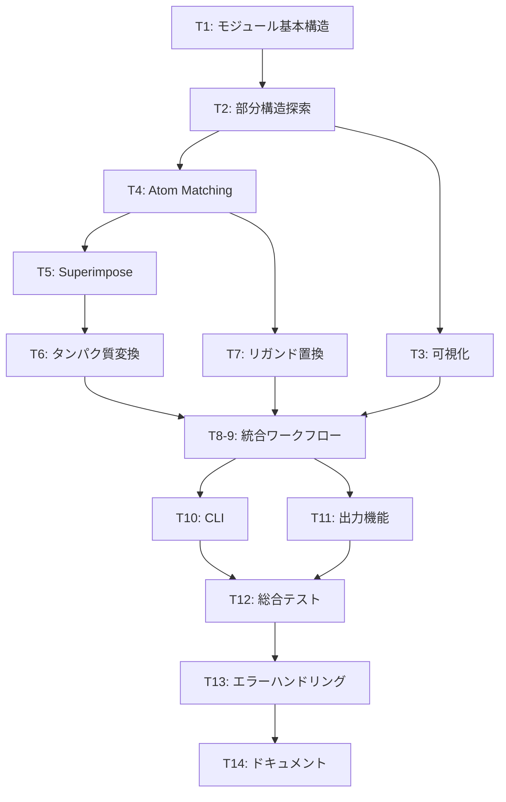

# タスク引き継ぎガイド

このドキュメントは、統合部分構造置換機能の実装を複数の作業者で分担する際の引き継ぎ情報をまとめたものです。

## 📋 ドキュメント体系

1. **[`integrated_replacement_plan.md`](integrated_replacement_plan.md)** - 全体設計と仕様
2. **[`testing_checklist.md`](testing_checklist.md)** - 各タスクのテスト方法
3. **[`testing_responsibility.md`](testing_responsibility.md)** - テスト責任分担
4. **本ドキュメント** - タスク引き継ぎガイド

---

## 🔄 タスク依存関係



**並列実行可能**: T2完了後、T3とT4は並列実行可能

---

## 📦 各タスクの入出力仕様（要約）

### T1: モジュール基本構造
- **成果物**: `inverse_msmd/substructure_replacement.py`（関数スタブ）
- **完了条件**: インポートエラーなし、全関数スタブ定義済み

### T2: 部分構造探索
- **実装**: `find_substructure_in_ligand()`
- **完了条件**: 複数マッチを正しく返す、テストパス

### T3: 可視化
- **実装**: `visualize_multiple_matches()`
- **完了条件**: PNG生成、**視覚的確認OK**

### T4: Atom Matching
- **実装**: `match_substructures()`
- **完了条件**: MCS検索動作、複数パターン返却

### T5: Superimpose
- **実装**: `calculate_transformation()`
- **完了条件**: 回転行列が直交行列、det=1

### T6: タンパク質変換
- **実装**: `apply_transformation_to_protein()`
- **完了条件**: 変換式適用、**PyMOL確認OK**

### T7: リガンド置換
- **実装**: `replace_ligand_substructure()`
- **完了条件**: Sanitizeパス、**分子構造確認OK**

### T8-9: 統合ワークフロー
- **実装**: `integrated_substructure_replacement()`
- **完了条件**: 全機能連携、出力ファイル生成

### T10: CLI
- **成果物**: `scripts/integrated_replacement.py`
- **完了条件**: 全オプション機能、ヘルプ適切

### T11: 出力機能
- **成果物**: ファイル命名規則の実装
- **完了条件**: 規則通りのファイル名、全パターン出力

### T12: 総合テスト
- **成果物**: エンドツーエンドテスト、**最終確認OK**
- **完了条件**: 全機能動作、研究目的に合致

### T13: エラーハンドリング
- **成果物**: エラーケース処理
- **完了条件**: 適切なエラーメッセージ、異常終了なし

### T14: ドキュメント
- **成果物**: README更新、docstrings完備
- **完了条件**: 使用例実行可能、FAQ充実

---

## 🔍 各タスクの詳細仕様

### タスク1: モジュール基本構造

**入力**: なし

**実装内容**:
```python
# inverse_msmd/substructure_replacement.py
from typing import List, Tuple, Optional, Dict
import numpy as np
from rdkit import Chem
from Bio.PDB.Structure import Structure

def find_substructure_in_ligand(...) -> List[Tuple[int, ...]]: pass
def visualize_multiple_matches(...) -> None: pass
def match_substructures(...) -> List[np.ndarray]: pass
def calculate_transformation(...) -> Tuple[np.ndarray, np.ndarray]: pass
def apply_transformation_to_protein(...) -> Structure: pass
def replace_ligand_substructure(...) -> Chem.Mol: pass
def integrated_substructure_replacement(...) -> List[Dict]: pass
```

**次の作業者への引き継ぎ**:
- 各関数のシグネチャ（型ヒント含む）
- docstringに役割を記述

---

### タスク2: 部分構造探索

**参考コード**: `scripts/replace_substructure.py:186`

**関数仕様**:
```python
def find_substructure_in_ligand(
    ligand_mol: Chem.Mol,
    substructure_mol: Chem.Mol
) -> List[Tuple[int, ...]]:
    """リガンド中の部分構造を探索"""
    # RDKitのGetSubstructMatches()を使用
    # 水素を除いた分子で処理
    # 複数マッチを全て返す
```

**テスト**: `testing_checklist.md`のタスク2参照

**引き継ぎ事項**:
- 水素原子の扱い（RemoveHs使用）
- マッチなし時は空リスト返却

---

### タスク3: 複数マッチ可視化

**参考コード**: `scripts/replace_substructure.py:404`

**関数仕様**:
```python
def visualize_multiple_matches(
    ligand_mol: Chem.Mol,
    substructure_mol: Chem.Mol,
    matches: List[Tuple[int, ...]],
    output_path: str
) -> None:
    """複数マッチをPNG画像として可視化"""
    # RDKit Draw.MolToImage()を使用
    # マッチ部分をハイライト表示
```

**完了条件**: ✅自動テスト + ⚠️**視覚的確認必須**

---

### タスク4: Atom Matching

**参考コード**: `inverse_msmd/alignment.py:102`

**関数仕様**:
```python
def match_substructures(
    mol1: Chem.Mol,
    mol2: Chem.Mol
) -> List[np.ndarray]:
    """2つの部分構造間のatom matching"""
    # MCS検索
    # 複数パターンを全て返す
    # 戻り値: List[shape(2, n_atoms)の配列]
```

**引き継ぎ事項**:
- atom pairsの形式: `np.array([[mol1_idx...], [mol2_idx...]])`

---

### タスク5: Superimpose計算

**参考コード**: `inverse_msmd/utils/bio_utils.py:39`

**関数仕様**:
```python
def calculate_transformation(
    source_coords: np.ndarray,  # shape: (n, 3)
    target_coords: np.ndarray,  # shape: (m, 3)
    atom_pairs: np.ndarray      # shape: (2, k)
) -> Tuple[np.ndarray, np.ndarray]:
    """変換行列を計算"""
    # SuperImposerを使用
    # 戻り値: (rot[3,3], tran[3])
```

**引き継ぎ事項**:
- 変換式: `new_coords = rot @ coords + tran`

---

### タスク6: タンパク質変換

**参考コード**: `inverse_msmd/alignment.py:191`

**関数仕様**:
```python
def apply_transformation_to_protein(
    protein: Structure,
    rot: np.ndarray,
    tran: np.ndarray
) -> Structure:
    """タンパク質に変換を適用"""
    # PDB.get_attr()で座標取得
    # 変換適用
    # PDB.set_attr()で座標設定
```

**完了条件**: ✅自動テスト + ⚠️**PyMOL確認必須**

---

### タスク7: リガンド置換

**参考コード**: `scripts/replace_substructure.py:106`

**関数仕様**:
```python
def replace_ligand_substructure(
    ligand_mol: Chem.Mol,
    match: Tuple[int, ...],
    replacement_mol: Chem.Mol,
    atom_pairs: np.ndarray
) -> Chem.Mol:
    """リガンドの部分構造を置換"""
    # create_replacement()を参考
    # 結合情報を保持
```

**完了条件**: ✅自動テスト + ⚠️**分子構造確認必須**

---

### タスク8-9: 統合ワークフロー

**関数仕様**:
```python
def integrated_substructure_replacement(
    ligand_file: str,
    protein_file: str,
    from_file: str,
    to_file: str,
    output_dir: str,
    match_index: Optional[int] = None
) -> List[Dict[str, str]]:
    """統合ワークフロー"""
    # 全関数を組み合わせ
    # 各パターンでファイル出力
    # 戻り値: [{'ligand_file': ..., 'protein_file': ...}, ...]
```

---

### タスク10: CLIスクリプト

**ファイル**: `scripts/integrated_replacement.py`

**必須オプション**:
```
--ligand          リガンドSDFファイル
--protein         タンパク質PDBファイル
--from-file       置換前部分構造
--to-file         置換後部分構造
--output          出力ディレクトリ
--match-index     (オプション) マッチインデックス
--verbose         (オプション) 詳細出力
```

---

## 🎯 レビュー基準

### 各タスク完了時のチェックリスト

**必須項目**:
- [ ] 仕様通りに動作する
- [ ] テストが全てパスする
- [ ] docstringが完備されている
- [ ] 型ヒントが適切
- [ ] 引き継ぎ事項が記録されている

**視覚的確認が必要なタスク**:
- **T3**: PNG画像の内容確認
- **T6**: PyMOLでの3D構造確認
- **T7**: 分子構造の2D確認
- **T12**: 最終結果の妥当性確認

---

## 📧 作業の流れ

### タスク開始時
1. 担当タスク番号を報告
2. 依存タスクの完了を確認
3. 参考コードを確認
4. 不明点は質問

### タスク完了時
1. 自動テストを実行
2. 視覚的確認が必要な場合は実施
3. 成果物を提出:
   - コード
   - テスト結果
   - 引き継ぎ事項
   - スクリーンショット（視覚的確認の場合）

### レビュー
1. レビュアーが確認
2. 問題があれば修正
3. 承認されたら次のタスクへ

---

## 📚 参考資料

### 必読コード
- [`inverse_msmd/alignment.py`](../inverse_msmd/alignment.py)
- [`scripts/replace_substructure.py`](../scripts/replace_substructure.py)
- [`inverse_msmd/utils/bio_utils.py`](../inverse_msmd/utils/bio_utils.py)

### 外部リソース
- RDKit: https://www.rdkit.org/docs/
- BioPython: https://biopython.org/wiki/Documentation
- NumPy: https://numpy.org/doc/

---

## ⚠️ 注意事項

### コーディング規約
- Python 3.8+
- 型ヒントを必ず付ける
- PEP 8に従う
- 既存コードのスタイルに合わせる

### ファイル管理
- テスト出力: `test_output/`
- 本番出力: `output/`
- 大きなファイルはGitにコミットしない

### セキュリティ
- ファイルパスの検証
- ユーザー入力のサニタイゼーション
- エラーメッセージに機密情報を含まない