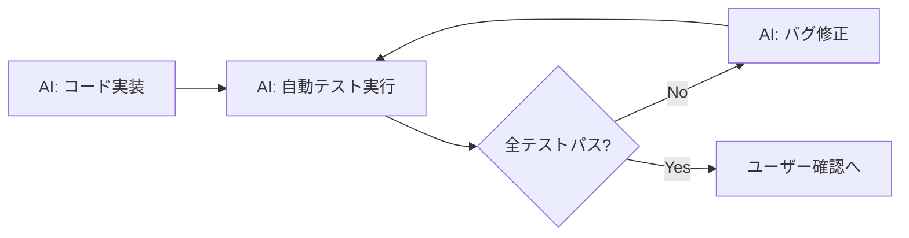
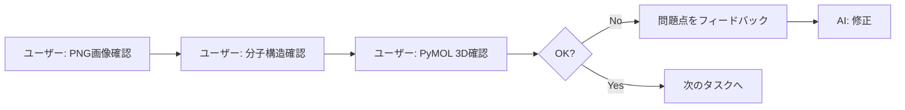

# テスト責任分担表

このドキュメントは、[`testing_checklist.md`](testing_checklist.md)の各テストについて、AIが自動実行できる部分と、ユーザーが手動で確認する必要がある部分を明確にします。

## 🎯 pytestスイートの導入

テストケースは[`tests/`](../tests/)ディレクトリのpytestスイートとして実装されており、自動実行が可能です。

```bash
# 全テスト実行（推奨）
./run_tests.sh all

# 単体テストのみ
./run_tests.sh unit

# 詳細は tests/README.md を参照
```

## 凡例
- ✅ **AI自動**: AIが完全に自動実行・検証可能
- 🔶 **AI補助**: AIが実行するが、ユーザーの最終確認が必要
- ⚠️ **手動必須**: ユーザーが手動で確認する必要がある

---

## タスク1: モジュール基本構造

### インポートテスト
| テスト項目 | 責任 | 理由 |
|-----------|------|------|
| モジュールのインポート | ✅ AI自動 | Pythonの構文エラーは自動検出可能 |
| 依存関係の確認 | ✅ AI自動 | import文の成功/失敗を自動判定 |

**AIが実行可能:** 100%

---

## タスク2: 部分構造探索

### 部分構造探索テスト
| テスト項目 | 責任 | 理由 |
|-----------|------|------|
| マッチ数の確認 | ✅ AI自動 | 数値の検証 |
| 原子数の一致確認 | ✅ AI自動 | 数値比較 |
| インデックスの範囲確認 | ✅ AI自動 | 論理的検証 |

**AIが実行可能:** 100%

---

## タスク3: 複数マッチ可視化

### PNG画像生成テスト
| テスト項目 | 責任 | 理由 |
|-----------|------|------|
| PNGファイルの生成 | ✅ AI自動 | ファイル存在確認 |
| ファイルサイズ確認 | ✅ AI自動 | 数値検証 |
| **画像の内容確認** | ⚠️ **手動必須** | 視覚的判断が必要 |
| **ハイライトの適切性** | ⚠️ **手動必須** | 化学的妥当性の判断 |
| **可読性の確認** | ⚠️ **手動必須** | 主観的判断 |

**AIが実行可能:** 40%
**ユーザー確認必須:** 60% (視覚的確認)

### ユーザーが行うべき確認
```bash
# 画像を開いて確認
code test_output/substructure_matches_test.png
# または
xdg-open test_output/substructure_matches_test.png
```

**確認事項:**
1. リガンド構造が明瞭に表示されているか
2. マッチした部分が適切にハイライトされているか
3. 複数マッチがある場合、それぞれが識別可能か
4. 画像の解像度は十分か

---

## タスク4: Atom Matching

### Atom Matchingテスト
| テスト項目 | 責任 | 理由 |
|-----------|------|------|
| マッチングパターン数 | ✅ AI自動 | 数値検証 |
| atom pairsの形状確認 | ✅ AI自動 | 配列形状の検証 |
| インデックス範囲確認 | ✅ AI自動 | 論理的検証 |
| **元素の一致確認** | 🔶 AI補助 | AIが検証するが、化学的妥当性は要確認 |

**AIが実行可能:** 90%
**ユーザー確認推奨:** 10% (化学的妥当性)

### AIが実装できる追加検証
```python
# 対応する原子の元素が一致しているか確認
for i in range(atom_pairs.shape[1]):
    e23_atom = e23_mol.GetAtomWithIdx(atom_pairs[0, i])
    e24_atom = e24_mol.GetAtomWithIdx(atom_pairs[1, i])
    assert e23_atom.GetSymbol() == e24_atom.GetSymbol(), \
        f"元素が一致しません: {e23_atom.GetSymbol()} != {e24_atom.GetSymbol()}"
```

---

## タスク5: Superimpose計算

### 変換行列計算テスト
| テスト項目 | 責任 | 理由 |
|-----------|------|------|
| 回転行列の形状確認 | ✅ AI自動 | 配列形状の検証 |
| 並進ベクトルの形状確認 | ✅ AI自動 | 配列形状の検証 |
| 回転行列の直交性確認 | ✅ AI自動 | 数学的検証（R^T * R = I） |
| 行列式の確認 | ✅ AI自動 | 数値検証（det = 1） |

**AIが実行可能:** 100%

---

## タスク6: タンパク質変換

### 座標変換テスト
| テスト項目 | 責任 | 理由 |
|-----------|------|------|
| 座標形状の保持確認 | ✅ AI自動 | 配列形状の検証 |
| 座標が変換されたか確認 | ✅ AI自動 | 数値比較 |
| 変換式の正確性確認 | ✅ AI自動 | 数学的検証 |
| PDBファイルの生成 | ✅ AI自動 | ファイル存在確認 |
| **PyMOLでの構造確認** | ⚠️ **手動必須** | 3D構造の視覚的確認 |
| **構造の破壊チェック** | ⚠️ **手動必須** | 生物学的妥当性の判断 |

**AIが実行可能:** 70%
**ユーザー確認必須:** 30% (3D構造確認)

### ユーザーが行うべき確認
```python
# PyMOLスクリプト
load data/sample_proteins/4hw3_A.pdb, original
load test_output/protein_transformed_test.pdb, transformed
align original, transformed
zoom
```

**確認事項:**
1. タンパク質が回転・並進しているか
2. 二次構造が保持されているか
3. 原子間距離が異常に変化していないか
4. 全体的な構造が破壊されていないか

---

## タスク7: リガンド置換

### 部分構造置換テスト
| テスト項目 | 責任 | 理由 |
|-----------|------|------|
| 原子数の確認 | ✅ AI自動 | 数値検証 |
| Sanitizeチェック | ✅ AI自動 | RDKitの検証機能 |
| SDFファイルの生成 | ✅ AI自動 | ファイル存在確認 |
| **分子構造の視覚的確認** | ⚠️ **手動必須** | 2D構造の確認 |
| **結合の適切性確認** | ⚠️ **手動必須** | 化学的妥当性の判断 |
| **不自然な構造の検出** | ⚠️ **手動必須** | ドメイン知識が必要 |

**AIが実行可能:** 60%
**ユーザー確認必須:** 40% (化学的妥当性)

### ユーザーが行うべき確認
```bash
# 分子ビューアで確認
# VSCodeまたは専用ソフトウェアで開く
code test_output/ligand_replaced_test.sdf
```

**確認事項:**
1. E23部分がE24に正しく置換されているか
2. 置換部位の結合が適切か
3. 全体的な分子構造が化学的に妥当か
4. 不自然な結合角や結合長がないか

---

## タスク8-11: 統合ワークフロー・CLI

### 統合テスト
| テスト項目 | 責任 | 理由 |
|-----------|------|------|
| 全パターンの出力確認 | ✅ AI自動 | ファイル存在確認 |
| ファイルサイズ確認 | ✅ AI自動 | 数値検証 |
| CLIオプションの動作 | ✅ AI自動 | コマンド実行テスト |
| ヘルプメッセージ表示 | ✅ AI自動 | テキスト出力確認 |
| **最終結果の妥当性** | ⚠️ **手動必須** | 研究目的に合致するか |

**AIが実行可能:** 80%
**ユーザー確認必須:** 20% (最終妥当性)

---

## タスク13: エラーハンドリング

### エラーケーステスト
| テスト項目 | 責任 | 理由 |
|-----------|------|------|
| 存在しないファイルエラー | ✅ AI自動 | 例外処理のテスト |
| 部分構造未検出エラー | ✅ AI自動 | エラーメッセージ確認 |
| 無効なインデックスエラー | ✅ AI自動 | 例外処理のテスト |
| エラーメッセージの適切性 | 🔶 AI補助 | AIが確認するが、わかりやすさは主観的 |

**AIが実行可能:** 90%
**ユーザー確認推奨:** 10% (エラーメッセージの品質)

---

## 最終統合テスト

### エンドツーエンドテスト
| テスト項目 | 責任 | 理由 |
|-----------|------|------|
| 全機能の動作確認 | ✅ AI自動 | スクリプト実行テスト |
| 出力ファイルの生成 | ✅ AI自動 | ファイル確認 |
| **PyMOLでの3D確認** | ⚠️ **手動必須** | 立体構造の視覚的評価 |
| **リガンド-タンパク質相互作用** | ⚠️ **手動必須** | 生物学的妥当性 |
| **研究目的への適合性** | ⚠️ **手動必須** | ドメイン知識が必要 |

**AIが実行可能:** 50%
**ユーザー確認必須:** 50% (最終的な妥当性評価)

---

## サマリー：テスト責任分担

### AIが完全自動で実行できるテスト（約70%）
1. **コードの実行とエラーチェック**
2. **ファイル存在とサイズの確認**
3. **数値計算の検証**（形状、範囲、数学的性質）
4. **論理的整合性チェック**
5. **例外処理のテスト**
6. **RDKitのSanitizeチェック**

### ユーザーが手動で確認する必要があるテスト（約30%）

#### 1. 視覚的確認（必須）
- **PNG画像の内容**
  - マッチ部分のハイライトが適切か
  - 画像が読みやすいか
  
- **分子構造の2D表示**
  - E23がE24に正しく置換されているか
  - 結合が化学的に妥当か
  
- **タンパク質の3D構造（PyMOL）**
  - 座標変換が正しく適用されているか
  - 構造が破壊されていないか

#### 2. 化学的・生物学的妥当性の評価（必須）
- 置換後の分子構造が化学的に妥当か
- リガンドとタンパク質の相対位置関係が適切か
- 研究目的に合致しているか

#### 3. 最終的な品質評価（推奨）
- エラーメッセージが分かりやすいか
- 出力ファイル名が適切か
- ドキュメントが十分か

---

## 実装・テストの推奨ワークフロー

### ステップ1: AI主導の実装とテスト


### ステップ2: ユーザーによる視覚的確認


### ステップ3: 反復的改善
1. AIが自動テストで基本的な正しさを保証
2. ユーザーが視覚的・ドメイン知識で最終確認
3. 問題があればフィードバックしてAIが修正
4. 全て良ければ次のタスクへ進む

---

## 推奨事項

### AIに任せるべきこと
- コードの実装と基本的なテスト
- 数値的・論理的な検証
- 例外処理のテスト
- ファイルI/Oの確認

### ユーザーが必ず確認すべきこと
- 生成された画像や構造の視覚的確認
- 化学的・生物学的妥当性の評価
- 最終的な研究目的への適合性

### 効率的な進め方
1. まず、AIが自動テストを全て実行
2. 自動テストがパスしたら、ユーザーに視覚的確認を依頼
3. ユーザーが問題を発見したら、詳細をフィードバック
4. AIが修正して再テスト
5. 全て良ければ次へ進む

これにより、AIとユーザーの強みを活かした効率的な開発が可能になります。